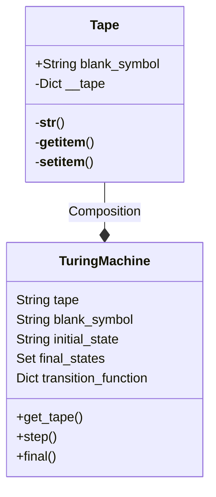

# 原理

Updated 1428 GMT+8 Dec 12, 2023

2023 fall, Complied by Hongfei Yan


AC4正常能优秀，届时需要稍微调整。学校看85分界。

大概思路是：免修级别的10%同学不算，再争取40%+优秀率。


```python
final_part_scores = [52, 60, 68, 79, 89, 100]  # AC1,..., AC6

base = min(84, 50 + 0.5 * final_part_scores[2])  # 85 constrain
print(f'{50 + 0.5 * final_part_scores[2]:.2f},', end="")
print(f'{base}%')

grades = [50 + 0.5 * score for score in final_part_scores]

print(f'AC0 unsure')
for i, grade in enumerate(grades):
    print(f'AC{i+1} {grade:.2f}')  # Homework complete
```


# 1 计算机原理

对计算机设计具有重要意义的三个原理：图灵机、进程的虚拟地址空间和 ASCII 表。

## 1.1 图灵机

​	艾伦·麦席森·图灵（Alan Mathison Turing，又译阿兰·图灵，1912 年 6 月 23 日－1954 年 6 月 7 日）。阿兰·图灵在 1937 年首次提出一个通用计算设备的设想。设想所有的计算都可能在一种特殊的机器上执行，这就图灵机（Turning Machine）。他将模型建立在人们进行计算过程的行为上，并将这些行为抽象到用于计算的机器的模型中。图灵机由两部分构成，如图1-13所示。

- 一条存储带（tape）：双向无限延长，上有一个个方格（field），每个方格可以包含一个有限字母的字符。在一个真正的机器中，磁带必须足够大，以包含算法的所有数据。

- 一个控制器：包含一个可以双向移动的读写头（head），可以在所处方格中读写一个字符；图灵机每时每刻都处于某种状态（current state），是有限数量的状态中的一种；可以接受设定好的图灵程序 （program），该程序是一个转换列表，它决定了一个给定的 State 和 head 下字符的新状态，一个必须写入 head 下方格的字符和  head 的运动方向，即左、右或静止不动。


图1-13 由一条存储带和一个控制器构成的图灵机（注：图片来源为 baike.sogou.com，2023年1月)


​	aturingmachine.com 上面展示了 Mike Davey 建造一台机器，如图1-14所示，体现图灵论文中提出的机器的经典外观和感觉。这台图灵机是由微控制器控制的，但它在运行时的操作只基于从 SD 卡加载的一组状态转换，以及从磁带上写入和读取的内容。虽然看起来磁带只是机器的输入和输出，但事实并非如此！磁带也不仅仅是机器的存储器。在某种程度上，磁带就是计算机。当磁带上的符号被简单的规则所操纵时，计算就发生了。图灵机的核心是读写头，传送磁带，并将磁带上的单元格适当地定位。它可以读取一个单元，确定那里写了什么，如果有的话，是什么符号。这台机器一次只工作在一个单元上，并且知道一个单元的情况。机器中的磁带是一卷1000英尺长的白色35毫米胶片带。字符1和0，是由机器用黑色笔写的。


图1-14  体现图灵机模型的机器（注：图片来源为aturingmachine.com，2022年5月）


​	附录1A 是软件实现图灵机，https://github.com/GMyhf/2019fall-cs101/tree/master/TuringMachine 。参考：https://www.python-course.eu/turing_machine.php ，增加了加法操作，实现下面14分钟视频中的加法。软件实现是用 Python 语言面向对象的编程（Object Orientation Programming，OOP）方式实现的。Python的 OOP 语法，可以参考 https://www.runoob.com/python3/python3-class.html 。

​	图灵机的构成，6分钟视频讲解在 https://www.bilibili.com/video/BV12B4y1X7QV/?spm_id_from=333.788

​	图灵机运作原理及示例，14分钟视频讲解在 https://www.bilibili.com/video/BV13v4y1w7yM/?spm_id_from=333.788


图灵机是一种理论上的计算模型，它具有计算能力上的完备性，也就是说，它可以解决任何可计算的问题。然而，在实际应用中，图灵机存在一些局限性，包括以下方面：

1. 计算复杂性：尽管图灵机可以解决任何可计算的问题，但某些问题的解决可能需要非常长的时间。例如，NP完全问题和其他计算复杂性理论中定义的问题属于这种情况。对于这些问题，图灵机可能需要指数级的计算时间，这在实际中是不可行的。

2. 计算资源需求：图灵机的计算资源需求可能非常高。尤其是对于某些复杂的问题，图灵机可能需要大量的内存和处理能力。这在实际应用中可能是不可行的，特别是在资源受限的环境中。

3. 并行计算限制：图灵机是一种顺序计算模型，它按照一步一步的顺序执行指令。这意味着它不能有效地利用并行计算资源。在某些问题中，利用并行计算可以加速计算过程，但图灵机无法直接实现这种并行性。

> 为了克服图灵机的一些局限性，人们提出了一些扩展和变种模型，如多带图灵机、非确定性图灵机和量子图灵机等。这些模型引入了新的计算机制，可以更好地处理某些问题。
>
> - 多带图灵机（Multi-Tape Turing Machine）：多带图灵机具有多个独立的工作带（tape），每个工作带上都可以进行读写操作。这使得多带图灵机可以并行地进行计算，加速某些问题的解决。
>
> - 非确定性图灵机（Nondeterministic Turing Machine）：非确定性图灵机允许在某个运算步骤中有多个可能的转移选择。这种模型可以用于描述一些问题的解空间，但在实际中并没有实现。
>
> - 量子图灵机（Quantum Turing Machine）：量子图灵机结合了量子计算的原理和图灵机的计算模型。它使用量子比特（qubits）来进行计算，并利用量子叠加和量子纠缠等特性来加速计算过程。量子图灵机可以解决某些问题，如因子分解和量子模拟，具有比经典图灵机更高的计算效率。
>
> 这些扩展和变种模型提供了更多的计算能力和效率，但它们仍然受到物理实现和技术限制的约束。目前，量子图灵机仍处于实验和研究阶段，尚未实现可扩展的通用量子计算机。
>
> 
>
> NP完全问题（NP-Complete problem）是计算机科学中的一个重要概念，指的是一类具有特殊性质的计算问题。NP完全问题具有两个关键特征：难以在多项式时间内解决和具有验证解的多项式时间可验证性。
>
> 具体来说，一个问题被称为NP完全问题，需要满足以下两个条件：
>
> 1. 难以在多项式时间内解决：意味着没有已知的高效算法可以在多项式时间内求解该问题。这意味着随着问题规模的增加，算法的运行时间会呈指数级增长，从而使得问题变得非常困难。
>
> 2. 多项式时间可验证性：意味着对于一个给定的可能解，可以在多项式时间内验证该解是否正确。也就是说，如果给出一个解，可以在多项式时间内验证这个解的正确性。
>
> NP完全问题是属于非确定性多项式时间（NP）类的问题。该类中的问题具有一种特殊的性质：如果我们有一个多项式时间算法可以解决其中一个问题，那么我们就可以在多项式时间内解决所有NP问题。换句话说，如果我们找到了一个NP完全问题的多项式时间算法，那么我们可以将其扩展到解决所有NP完全问题。
>
> 著名的NP完全问题包括旅行商问题（Traveling Salesman Problem）、背包问题（Knapsack Problem）、图着色问题（Graph Coloring Problem）等。这些问题在实际中广泛应用，但目前没有已知的高效算法可以在多项式时间内解决它们。因此，研究人员一直在寻找解决NP完全问题的更有效的算法和启发式方法。


### 1.1.1 软件实现图灵机

​	如图附录1A-1所示，先给出两个类图（类图相当于是 OOP 编程实现前的蓝图设计），Tape 类 和 TuringMachine 类，然后给出 Python 实现代码，下载网址 https://github.com/GMyhf/2019fall-cs101/tree/master/TuringMachine ，参考了  https://www.python-course.eu/turing_machine.php。	

​	图灵机是一个数学模型，是一个简单的计算机模型，但它具有通用计算机的完整计算能力。

​	图灵机定义为 $M = （Q, \Sigma, \Gamma, \delta, b, q_0, q_f）$

​	\- $Q$ 表示控制器有限状态集 (the set of states)

​	- $\Sigma$ 表示输入的字母表 (the input alphabet)

​	\- $\Gamma$ 表示磁带上的字母表 (the tape alphabet)，$\Sigma \subseteq \Gamma$

​	\- $\delta: Q \times \Gamma \rightarrow Q \times \Gamma \times \{L, R, N\}$ 是状态转移函数 (the transition function)，即图程序。L、R、N分别表示左移一格，右移一格或停机

​	\- $b$ 是空白字符 (the blank symbol)，$b \in \Gamma \backslash \Sigma$ 

​	\- $q_0$ 是开始状态，$q_0 \in Q$

​	\- $q_f$ 是接收或终止状态，$q_f \in Q$




图附录1A-1 图灵机类图


​	三个源码：turing_machine.py, binary_complement, TM_adding.py。前两个取自 https://www.python-course.eu/turing_machine.php，实现了二进制补0到1，1到0的代码。我们增加了第三个做加法的代码。

```python
# ref: https://www.python-course.eu/turing_machine.php
# turing_machine.py
class Tape:
    blank_symbol = " "
    
    def __init__(self,tape_string = ""):
        self.__tape = dict((enumerate(tape_string)))
        # last line is equivalent to the following three lines:
        #self.__tape = {}
        #for i in range(len(tape_string)):
        #    self.__tape[i] = input[i]
        
    def __str__(self):
        s = ""
        min_used_index = min(self.__tape.keys()) 
        max_used_index = max(self.__tape.keys())
        for i in range(min_used_index, max_used_index):
            s += self.__tape[i]
        return s    
   
    def __getitem__(self,index):
        if index in self.__tape:
            return self.__tape[index]
        else:
            return Tape.blank_symbol

    def __setitem__(self, pos, char):
        self.__tape[pos] = char 

        
class TuringMachine:
    
    def __init__(self, 
                 tape = "", 
                 blank_symbol = " ",
                 initial_state = "",
                 final_states = None,
                 transition_function = None):
        self.__tape = Tape(tape)
        self.__head_position = 0
        self.__blank_symbol = blank_symbol
        self.__current_state = initial_state
        if transition_function == None:
            self.__transition_function = {}
        else:
            self.__transition_function = transition_function
        if final_states == None:
            self.__final_states = set()
        else:
            self.__final_states = set(final_states)
        
    def get_tape(self): 
        return str(self.__tape)
    
    def step(self):
        char_under_head = self.__tape[self.__head_position]
        x = (self.__current_state, char_under_head)
        if x in self.__transition_function:
            y = self.__transition_function[x]
            self.__tape[self.__head_position] = y[1]
            if y[2] == "R":
                self.__head_position += 1
            elif y[2] == "L":
                self.__head_position -= 1
            self.__current_state = y[0]

    def final(self):
        if self.__current_state in self.__final_states:
            return True
        else:
            return False
```


​	如果对上面类图的写法不熟悉，可以直接看下面两个 二进制补、加法的 程序，把TuringMachine理解为提供的图灵机工具。

```python
# binary_complement.py
from turing_machine import TuringMachine

initial_state = "init",
accepting_states = ["final"],
transition_function = {("init","0"):("init", "1", "R"),
                       ("init","1"):("init", "0", "R"),
                       ("init"," "):("final"," ", "N"),
                       }
final_states = {"final"}

t = TuringMachine(tape = "010011001",
                  initial_state = "init",
                  final_states = final_states,
                  transition_function = transition_function)

print("Input on Tape:\n" + t.get_tape())

while not t.final():
    t.step()

print("Result of the Turing machine calculation:")
print(t.get_tape())
```

​	运行输出

```
Input on Tape:
01001100
Result of the Turing machine calculation:
101100110
```


​	我们实现了“图灵机运作原理及示例” 视频中讲到的加法， https://www.bilibili.com/video/BV13v4y1w7yM/?spm_id_from=333.788。注意该视频讲解，缺少终止状态，会死循环，所以程序中加了终止状态final_states。


```python
# TM_adding.py
#ref: https://www.python-course.eu/turing_machine.php

from turing_machine import TuringMachine

initial_state = "q1",
accepting_states = ["q3"],
transition_function = {("q1","1"):("q1", "1", "R"),
                       ("q1"," "):("q2", "1", "R"),
                       ("q2","1"):("q2", "1", "R"),
                       ("q2"," "):("q3", "b", "L"),
                       ("q3","1"):("q3", "b", "H"),
                       ("q3"," "):("q3", "b", "H")
                       }
final_states = {"q3"}

t = TuringMachine(tape = "1111 111 ", 
                  initial_state = "q1",
                  final_states = final_states,
                  transition_function = transition_function)

print("Input on Tape:\n" + t.get_tape())

while not t.final():
    t.step()
    #print(t.get_tape())

print("Result of the Turing machine calculation:")    
print(t.get_tape())
```

​	运行输出

```
Input on Tape:
1111 1111
Result of the Turing machine calculation:
1111111
```


### 1.1.2 并行计算限制

图灵机是一种顺序计算模型，它按照一步一步的顺序执行指令。这意味着它不能有效地利用并行计算资源。在某些问题中，利用并行计算可以加速计算过程，但图灵机无法直接实现这种并行性。

#### 1843D. Apple Tree

Combinatorics, dfs and similar, dp, math, trees, *1200

https://codeforces.com/problemset/problem/1843/D

Timofey has an apple tree growing in his garden; it is a rooted tree of 𝑛 vertices with the root in vertex 1 (the vertices are numbered from 1 to 𝑛). A tree is a connected graph without loops and multiple edges.

This tree is very unusual — it grows with its root upwards. However, it's quite normal for programmer's trees.

The apple tree is quite young, so only two apples will grow on it. Apples will grow in certain vertices (these vertices may be the same). After the apples grow, Timofey starts shaking the apple tree until the apples fall. Each time Timofey shakes the apple tree, the following happens to each of the apples:

Let the apple now be at vertex 𝑢.

- If a vertex 𝑢 has a child, the apple moves to it (if there are several such vertices, the apple can move to any of them).
- Otherwise, the apple falls from the tree.

It can be shown that after a finite time, both apples will fall from the tree.

Timofey has 𝑞 assumptions in which vertices apples can grow. He assumes that apples can grow in vertices 𝑥 and 𝑦, and wants to know the number of pairs of vertices (𝑎, 𝑏) from which apples can fall from the tree, where 𝑎 — the vertex from which an apple from vertex 𝑥 will fall, 𝑏 — the vertex from which an apple from vertex 𝑦 will fall. Help him do this.

**Input**

The first line contains integer 𝑡 (1≤𝑡≤10^4^) — the number of test cases.

The first line of each test case contains integer 𝑛 (2≤𝑛≤2⋅10^5^) — the number of vertices in the tree.

Then there are 𝑛−1 lines describing the tree. In line 𝑖 there are two integers 𝑢𝑖 and 𝑣𝑖 (1≤𝑢𝑖,𝑣𝑖≤𝑛, 𝑢𝑖≠𝑣𝑖) — edge in tree.

The next line contains a single integer 𝑞 (1≤𝑞≤2⋅10^5^) — the number of Timofey's assumptions.

Each of the next 𝑞 lines contains two integers 𝑥𝑖 and 𝑦𝑖 (1≤𝑥𝑖,𝑦𝑖≤𝑛) — the supposed vertices on which the apples will grow for the assumption .

It is guaranteed that the sum of  𝑛 does not exceed 2⋅10^5^. Similarly, It is guaranteed that the sum of 𝑞 does not exceed 2⋅10^5^.

**Output**

For each Timofey's assumption output the number of ordered pairs of vertices from which apples can fall from the tree if the assumption is true on a separate line.

Examples

input

```
2
5
1 2
3 4
5 3
3 2
4
3 4
5 1
4 4
1 3
3
1 2
1 3
3
1 1
2 3
3 1
```

output

```
2
2
1
4
4
1
2
```

input

```
2
5
5 1
1 2
2 3
4 3
2
5 5
5 1
5
3 2
5 3
2 1
4 2
3
4 3
2 1
4 2
```

output

```
1
2
1
4
2
```

Note

In the first example:

- For the first assumption, there are two possible pairs of vertices from which apples can fall from the tree: (4,4),(5,4)(4,4),(5,4).
- For the second assumption there are also two pairs: (5,4),(5,5)(5,4),(5,5).
- For the third assumption there is only one pair: (4,4)(4,4).
- For the fourth assumption, there are 44 pairs: (4,4),(4,5),(5,4),(5,5)(4,4),(4,5),(5,4),(5,5).

Tree from the first example.

For the second example, there are 44 of possible pairs of vertices from which apples can fall: (2,3),(2,2),(3,2),(3,3)(2,3),(2,2),(3,2),(3,3). For the second assumption, there is only one possible pair: (2,3)(2,3). For the third assumption, there are two pairs: (3,2),(3,3)(3,2),(3,3).


蒋子轩23工学院 清晰明了的程序，dfs with thread.

```python
import sys
import threading
sys.setrecursionlimit(1 << 30)
threading.stack_size(2*10**8)


def main():
    def build_tree(edges):
        tree = {}
        for edge in edges:
            u, v = edge
            tree.setdefault(u, []).append(v)
            tree.setdefault(v, []).append(u)
        return tree

    def count_leaves(tree, vertex, parent, leaves_count):
        child_count = 0
        for child in tree[vertex]:
            if child != parent:
                child_count += count_leaves(tree, child, vertex, leaves_count)
        #if len(tree[vertex]) == 1 and vertex != parent:  # 当前节点是叶子节点
        if len(tree[vertex]) == 1 and vertex != 1:
            leaves_count[vertex] = 1
            return 1
        leaves_count[vertex] = child_count  # 当前节点的叶子节点数等于其子节点的叶子节点数之和
        return leaves_count[vertex]

    def process_assumptions(tree, leaves_count, assumptions):
        for x, y in assumptions:
            result = leaves_count[x] * leaves_count[y]
            print(result)

    t = int(input())
    for _ in range(t):
        n = int(input())
        edges = []
        for _ in range(n - 1):
            edges.append(tuple(map(int, input().split())))

        tree = build_tree(edges)
        leaves_count = {node: 0 for node in range(1, n + 1)}
        count_leaves(tree, 1, 0, leaves_count)  # 从根节点开始遍历计算叶子节点数量
        #print(tree, leaves_count)
        q = int(input())
        assumptions = []
        for _ in range(q):
            assumptions.append(tuple(map(int, input().split())))

        process_assumptions(tree, leaves_count, assumptions)


thread = threading.Thread(target=main)
thread.start()
thread.join()
```


## 1.2 虚拟地址空间

​	计算机的基础架构自从 20 世纪 40 年代起就已经形成规范，包括处理器、存储指令和数据的内存、输入和输出设备。它通常叫作冯·诺依曼架构，以约翰·冯·诺依曼（德語：John Von Neumann，1903 年12 月 28 日－1957 年 2 月 8 日）的名字来命名，他在 1946 年发表的论文里描述了这一架构。论文的开头句，用现在的专门术语来说就是，CPU提 供算法和控制，而 RAM 和磁盘则是记忆存储，键盘、鼠标和显示器与操作人员交互。其中需要重点理解的是与存储相关的进程的虚拟地址空间。

​	在《深入理解计算机系统》[8]第一章中讲到了进程的虚拟地址空间。虚拟存储器是一个抽象概念，它为每个进程提供了一个假象，好像每个进程都在独占地使用主存。每个进程看到的存储器都是一致的，称之为虚拟地址空间。如图1-15所示的是 Linux 进程的虚拟地址空间（其他 Unix 系统的设计与此类似）。在 Linux 中，最上面的四分之一的地址空间是预留给操作系统中的代码和数据的，这对所有进程都一样。底部的四分之三的地址空间用来存放用户进程定义的代码和数据。请注意，图中的地址是从下往上增大的。


图1-15 进程的虚拟地址空间（Process virtual address space）（注：图片来源为 Randal Bryant[8]，2015年3月）


​	每个进程看到的虚拟地址空间由准确定义的区（area）构成，每个区都有专门的功能。简单看下每一个区，从最低的地址开始，逐步向上研究。

- 程序代码和数据（code and data）。代码是从同一固定地址开始，紧接着的是和全局变量相对应的数据区。代码和数据区是由可执行目标文件直接初始化的，示例中就是可执行文件hello。

- 堆（heap）。紧随代码和数据区之后的是运行时堆（Run-time heap）。代码和数据区是在进程一旦开始运行时就被指定了大小的，与此不同，作为调用像 malloc 和 free 这样的 C 标准库函数的结果，堆可以在运行时动态地扩展和收缩。

- 共享库（shared libraries）。在地址空间的中间附近是一块用来存放像标准库和数学库这样共享库的代码和数据的区域。共享库的概念非常强大。

- 栈（stack）。位于用户虚拟地址空间顶部的是用户栈，编译器用它来实现函数调用。和堆一样，用户栈（User stack）在程序执行期间可以动态地扩展和收缩。特别地，每次我们调用一个函数时，栈就会增长。每次我们从函数返回时，栈就会收缩。

- 内核虚拟存储器（kernal virtal memory）。内核是操作系统总是驻留在存储器中的部分。地址空间顶部是为内核预留的。应用程序不允许读写这个区域的内容或者直接调用内核代码定义的函数。

​	虚拟存储器的运作需要硬件和操作系统软件间的精密复杂的互相合作，包括对处理器生成的每个地址的硬件翻译。基本思想是把一个进程虚拟存储器的内容存储在磁盘上，然后用主存作为磁盘的高速缓存。


### 1.2.1 将递归视为一种扩展的循环控制结构，通过遍历来找到问题的答案

递归的特点和优缺点也是很重要的。递归的特点包括问题分解、自我调用和终止条件。然而，递归也可能引发一些问题，例如递归深度过大可能导致栈溢出，递归算法的效率可能不如迭代等。因此，在使用递归时需要注意选择合适的问题和适当的终止条件，以避免潜在的问题。

​	此时可以回顾计算机原理——虚拟地址空间，其中的栈（stack）段与递归紧密相关。每个进程看到的虚拟地址空间由准确定义的区（area）构成，每个区都有专门的功能。栈位于用户虚拟地址空间顶部的是用户栈，编译器用它来实现函数调用。和堆一样，用户栈（User stack）在程序执行期间可以动态地扩展和收缩。特别地，每次我们调用一个函数时，栈就会增长。每次我们从函数返回时，栈就会收缩。


#### 02287: Tian Ji -- The Horse Racing

greedy, http://cs101.openjudge.cn/practice/02287


解决问题的基本情况和递归关系，列出逻辑处理过程的要点：

田忌赛马题目中基本情况是比赛轮数大于等于n。递归关系是在每次递归调用中，计算两种情况下的得分：一种是田忌使用当前最普通马与国王的最普通马比较，另一种是田忌使用最普通马与国王的最超级马比较。然后，选择得分最高的情况作为当前轮次的最优解。

程序解读：

限定了递归深度。实现了比较函数和深度优先搜索函数，并且通过lru_cache来存储记忆化结果。

程序的主要逻辑在一个while循环中，当输入的n等于0时，循环结束。在每个测试用例中，程序首先读取田忌和国王马的速度值，并对它们进行排序。

接下来，程序定义了一个使用递归的深度优先搜索(dfs)函数。dfs函数的参数包括当前轮次的国王马起始位置(start)、结束位置(end)、当前田忌马的索引(i)和比赛轮数n。

dfs

```python
# 赵时阳-数院23

from functools import lru_cache
import sys
sys.setrecursionlimit(1 << 30)


def compare(a, b):
    if a > b:
        return 1
    elif a == b:
        return 0
    else:
        return -1

while True:
    n = int(input())
    if n == 0: 
        break

    tian_values = list(map(int, input().split()))
    king_values = list(map(int, input().split()))
    tian_values.sort()
    king_values.sort()

    @lru_cache(maxsize=2048)
    def dfs(start, end, i):
        if i < n:
            tian_value = tian_values[i]
            king_value_start = king_values[start]
            x1 = dfs(start + 1, end, i + 1) + compare(tian_value, king_value_start)
            
            king_value_end = king_values[end]
            x2 = dfs(start, end - 1, i + 1) + compare(tian_value, king_value_end)  
            x = max(x1, x2)
            return x
        else:
            return 0

    result = dfs(0, n - 1, 0)
    print(200 * result)

```


## 1.3 ASCII 表

​	在《 计算机科学导论》[6]第三章中讲到，计算机外部的不同数据类型（Text, Number, Image, Audio, Video）的数据都采用统一的数据表示法转换后存入计算机中，输出时再还原回来，这种通用的格式称为位模式（bit pattern）。不同数据类型的存储如图1-16所示。


图1-16 不同数据类型的存储（注：图片来源为 Behrouz Forouzan[6]，2008年12月）


​	位（bit）是存储在计算机中的最小数据单位，它是0或1。位代表设备的某一状态，例如：用1表示开关合上，0表示断开。为了表示数据的不同类型，使用位模式，它是一个序列，是0和1组和。通常长度位8的位模式称为1个字节（byte）。

​	接下来我们来看文本（Text）是如何存储的。在任何语言中, 文本都是由一些符号组成。位模式可以表示任何一个符号。需要多少位来表示一个符号取决于该语言使用的符号的数量，如表1-2所示。


表1-2 符号数量和位模式长度

| 符号数目 | 位模式的长度 |
| -------- | ------------ |
| 2        | 1            |
| 4        | 2            |
| 8        | 3            |
| 16       | 4            |
| 256      | 8            |
| 65536    | 16           |

​		

​	不同的位模式集合被设计用于表示文本符号，每个集合被称为代码表, 表示符号的过程称为编码。美国国家标准协会（American National Standards Institute，记为 ANSI）发布了美国信息交换标准码（American Standard Code for Information Interchange，记为 ASCII）的代码表。该代码使用一串 7位二进制数表示每个符号，可以定义 2^7^=128 种不同的符号，包括英语中常用的 26 个大写字母，26 个小写字母，9 个字符，以及标点符号等。如图1-17所示，展示了四个大写字母对应的二进制位模式表示。


图1-17 大写字母的二进制位模式表示


​	编程语言，如果注释也写成英文，使用ASCII中包含的字符就够用了。ASCII 为控制字符保留了前 32个代码，这些代码最初的目的不是为了携带可打印信息，而是为了控制使用 ASCII 的设备（如打印机）。例如，十进制字符 10 代表 "换行 "功能（使打印机推进纸张），字符 27 代表 "转义 "键，经常出现在普通[键盘]的左上角。代码 127（全部七位开启），另一个特殊字符，相当于 "删除 "或 "擦除"。需要掌握的是图1-18中划线标识的代码，10 换行，13 回车，48-57 表示数字 0-9，65-90 表示大写字母，97-122 表示小写字母。如果记不住确切的对应十进制字符，记住大写字母在小写字母之前也可以。


图1-18 ASCII代码表（注：图片来源为 lookuptables.com。增加了两条横线和三个矩形框，用来突出重点部分）


​	如果有 Python 环境，可以在命令行中，输出 ASCII 表内容。

```python
In[1]: import string
In[2]: string.printable

Out[2]: '0123456789abcdefghijklmnopqrstuvwxyzABCDEFGHIJKLMNOPQRSTUVWXYZ!"#$%&\'()*+,-./:;<=>?@[\\]^_`{|}~ \t\n\r\x0b\x0c'
```


​	第 2 行的 string.printable 是调用了 string 类中的 printable 函数。如果想知道 string 中包含哪些函数，可以 dir。

```python
In[3]: dir(string)
Out[3]: 
['Formatter',
 'Template',
 '_ChainMap',
 '_TemplateMetaclass',
 '__all__',
 '__builtins__',
 '__cached__',
 '__doc__',
 '__file__',
 '__loader__',
 '__name__',
 '__package__',
 '__spec__',
 '_re',
 '_sentinel_dict',
 '_string',
 'ascii_letters',
 'ascii_lowercase',
 'ascii_uppercase',
 'capwords',
 'digits',
 'hexdigits',
 'octdigits',
 'printable',
 'punctuation',
 'whitespace']
```


​	ASCII 有结构特点。数字 0-9 以二进制的方式表示，其数值前缀为 0011。小写字母和大写字母在位模式上只有一位的差别，这就把大小写转换简化为一个范围测试（以避免转换不是字母的字符）和一个单一的比特操作。快速的大小写转换很重要，因为它经常被用于大小写搜索算法中。

​	例子: 将任何 ASCII 字母变成小写字母。

​	在 ASCII 中，大写字母和小写字母的区别在于位 00100000（十六进制表示是 20h）的值，该位在小写字母中被打开。如果 "打开 "这个位，大写字母就会变成小写字母。(如果该字母已经是小写字母，20h位已经打开；打开它没有任何区别)。 "打开 " 20h 位，被称为 ORing-in 位，因为使用的是位布尔 OR 操作符（bitwise Boolean OR operator，http://teaching.idallen.com/cst8214/08w/notes/bit_operations.txt）。


```python
'''
				01000001 = 41h = ASCII upper-case letter 'A'

OR			00100000 = 20h <-- this is the bit we want turned on

				--------

EQUALS	01100001 = 61h = ASCII lower-case letter 'a'
'''

uppera = ord('A')
lowera = uppera | 0x20    # bitwise OR with 20h 
print(chr(lowera))

lowera = uppera  |  (1<<5)
print(chr(lowera))


lowera = ord('a')
uppera = lowera  &  ~0x20    # bitwise AND with 10111111
print(chr(uppera))

uppera = lowera  &  ~(1<<5)
print(chr(uppera))

#a
#a
#A
#A
```


### 1.3.1 字符串

#### 04030: 统计单词数

string, http://cs101.openjudge.cn/practice/04030

一般的文本编辑器都有查找单词的功能，该功能可以快速定位特定单词在文章中的位置，有的还能统计出特定单词在文章中出现的次数。
现在，请你编程实现这一功能，具体要求是：给定一个单词，请你输出它在给定的文章中出现的次数和第一次出现的位置。注意：匹配单词时，不区分大小写，但要求完全匹配，即给定单词必须与文章中的某一独立单词在不区分大小写的情况下完全相同 （参见样例 1） ，如果给定单词仅是文章中某一单词的一部分则不算匹配（参见样例 2） 。

**输入**

第 1 行为一个字符串，其中只含字母，表示给定单词；
第 2 行为一个字符串，其中只可能包含字母和空格，表示给定的文章。

**输出**

只有一行， 如果在文章中找到给定单词则输出两个整数， 两个整数之间用一个空格隔开，分别是单词在文章中出现的次数和第一次出现的位置（即在文章中第一次出现时，单词首字母在文章中的位置，位置从 0 开始） ；如果单词在文章中没有出现，则直接输出一个整数-1。

样例输入

```
样例 #1:
To 
to be or not to be is a question 

样例 #2:
to 
Did the Ottoman Empire lose its power at that time
```

样例输出

```
样例 #1:
2 0

样例 #2:
-1
```

提示

【输入输出样例 1 说明】
输出结果表示给定的单词 To 在文章中出现两次，第一次出现的位置为 0。

【输入输出样例 2 说明】
表示给定的单词 to 在文章中没有出现，输出整数-1。

【数据范围】
1 ≤单词长度≤10。
1 ≤文章长度≤1,000,000。


2021fall-cs101，陈勇。这道题需要先在语句两头加“ ”进行保护，然后用“ ”+关键词+“ ”进行搜素。

```python
string = ' ' + input().lower() + ' '
sentence = ' ' + input().lower() + ' '
loc = sentence.find(string)
if loc < 0:
    print(-1)
else:
    pro_stc = sentence.split()
    print(pro_stc.count(string[1:-1]), loc)
```


2021fall-cs101，吉祥瑞。注：

（1）第3行，前后加空格是一种巧妙的方法。
（2）第7行，单词总数不能用(' '+article+' ').count(' '+word+' ') 来求，例如，' a a '.count(' a ') 的结果是1而不是2，因为在计入第1个' a ' 后，就只剩下'a ' 了。
（3）样例输入首行的末尾有多余的空格，直接复制样例输入会使程序报错。
易错点：文章中单词之间可能有多个空格。

```python
word = input().lower()
article = input().lower()
first = (' '+article+' ').find(' '+word+' ')
if first == -1:
    print(-1)
else:
    print(article.split().count(word), first)
```

2021fall-cs101，吉祥瑞。直接做，纯属练习。

```python
word = input().lower()
article = input().lower()
e = tot = 0
while e < len(article):
    s = e
    while s < len(article) and article[s] == ' ':
        s += 1
    e = s
    while e < len(article) and article[e] != ' ':
        e += 1
    if article[s:e] == word:
        tot += 1
        if tot == 1:
            first = s
if tot == 0:
    print(-1)
else:
    print(tot, first)
```


# 2 二进制


## 02706: 麦森数

http://cs101.openjudge.cn/routine/02706/

形如2\^p-1的素数称为麦森数，这时P一定也是个素数。但反过来不一定，即如果P是个素数。2^p-1不一定也是素数。到1998年底，人们已找到了37个麦森数。最大的一个是P=3021377，它有909526位。麦森数有许多重要应用，它与完全数密切相关。
任务：从文件中输入P (1000<P<3100000) ,计算 2^p-1 的位数和最后500位数字（用十进制高精度数表示）

**输入**

文件中只包含一个整数P (1000<P<3100000)

**输出**

第1行：十进制高精度数 2^p-1 的位数。
第2-11行：十进制高精度数 2^p-1的最后500位数字。（每行输出50位，共输出10行，不足500位时高位补0）
不必验证 2^p-1与P是否为素数。

样例输入

```
1279
```

样例输出

```
386
00000000000000000000000000000000000000000000000000
00000000000000000000000000000000000000000000000000
00000000000000104079321946643990819252403273640855
38615262247266704805319112350403608059673360298012
23944173232418484242161395428100779138356624832346
49081399066056773207629241295093892203457731833496
61583550472959420547689811211693677147548478866962
50138443826029173234888531116082853841658502825560
46662248318909188018470682222031405210266984354887
32958028878050869736186900714720710555703168729087
```

来源

联赛复赛试题2003


```python
# 23数院 胡睿诚
from math import log10, ceil
M = 10**500
MAXP = 3100000

p = int(input())
print(int(p*log10(2)) + 1)
#print(ceil(p*0.3010299956639812))

a = [2]
for _ in range(len(bin(MAXP)) - 2):
    a.append((a[-1]**2) % M)

s = 1
i = 0
for j in reversed(bin(p)[2:]):
    if j == '1':
        s = (s*a[i]) % M
    i += 1

ans = list(str(s-1))
l = len(ans)
if l < 500:
    ans = ['0']*(500-l)+ans
for i in range(0, 500, 50):
    print(''.join(ans[i:i+50]))
```


# 3 Data structure 堆

## 18164: 剪绳子

greedy/huffman, http://cs101.openjudge.cn/practice/18164/


## 04087: 数据筛选

data structure, http://cs101.openjudge.cn/practice/04087/

总时间限制: 10000ms 单个测试点时间限制:  5000ms 内存限制: **3000kB**

描述

小张需要从一批数量庞大的正整数中挑选出第k小的数，因为数据量太庞大，挑选起来很费劲，希望你能编程帮他进行挑选。

**输入**

第一行第一个是数据的个数n(10<=n<=106)，第二个是需要挑选出的数据的序号k(1<=k<=105)，n和k以空格分隔； 第二行以后是n个数据T(1<=T<=109)，数据之间以空格或者换行符分隔。

**输出**

第k小数（如果有相同大小的也进行排序，例如对1,2,3,8,8，第4小的为8，第5小的也为8）。

样例输入

`10 5 1  3  8 20 2  9 10 12  8 9 `

样例输出

`8`


```python
import array										# Memory Limit Exceed
import heapq

n, k = map(int, input().split())

q = []
cnt = 0

while True:
    x = array.array('i', map(int, input().split()))
    cnt += len(x)
    for i in x:
        heapq.heappush(q, -i)
        if len(q) > k:
            heapq.heappop(q)
    if cnt >= n:
        break

print(-q[0])
```


该程序的功能是从输入的一组整数中找到第 k 大的数。它使用优先队列来维护当前遍历到的最大的 k 个数，每次将新的数插入到队列中，如果队列的大小超过了 k，则将最大的数移除。最后输出优先队列的顶部元素，即第 k 大的数。

```c++
#include <iostream>								// time: 340ms
#include <queue>
using namespace std;

int main() {

	int n,k,num;
	cin>>n>>k;

	priority_queue<int> q;

	for (int i=0; i<n; ++i) {
		cin>>num;
		q.push(num);
		if (q.size() > k)
			q.pop();
	}

	cout<<q.top()<<endl;

	return 0;
}
```


## 1883D. In Love

data structure, greedy, *1500

https://codeforces.com/contest/1883/problem/D

Initially, you have an empty multiset of segments. You need to process 𝑞 operations of two types:

- \+ 𝑙 𝑟 — Add the segment (𝑙,𝑟) to the multiset,
- − 𝑙 𝑟 — Remove **exactly** one segment (𝑙,𝑟) from the multiset. It is guaranteed that this segment exists in the multiset.

After each operation, you need to determine if there exists a pair of segments in the multiset that do not intersect. A pair of segments (𝑙,𝑟) and (𝑎,𝑏) do not intersect if there does not exist a point 𝑥 such that 𝑙≤𝑥≤𝑟 and 𝑎≤𝑥≤𝑏.

**Input**

The first line of each test case contains an integer 𝑞 (1≤𝑞≤10^5^) — the number of operations.

The next 𝑞 lines describe two types of operations. If it is an addition operation, it is given in the format \+ 𝑙 𝑟. If it is a deletion operation, it is given in the format − 𝑙 𝑟 (1≤𝑙≤𝑟≤10^9^).

**Output**

After each operation, print "YES" if there exists a pair of segments in the multiset that do not intersect, and "NO" otherwise.

You can print the answer in any case (uppercase or lowercase). For example, the strings "yEs", "yes", "Yes", and "YES" will be recognized as positive answers.

Example

input

```
12
+ 1 2
+ 3 4
+ 2 3
+ 2 2
+ 3 4
- 3 4
- 3 4
- 1 2
+ 3 4
- 2 2
- 2 3
- 3 4
```

output

```
NO
YES
YES
YES
YES
YES
NO
NO
YES
NO
NO
NO
```

Note

In the example, after the second, third, fourth, and fifth operations, there exists a pair of segments (1,2)(1,2) and (3,4)(3,4) that do not intersect.

Then we remove exactly one segment (3,4)(3,4), and by that time we had two segments. Therefore, the answer after this operation also exists.


```python
'''
The claim is that if the answer exists, we can take the segment with 
the minimum right boundary and the maximum left boundary 
(let's denote these boundaries as 𝑟 and 𝑙). Therefore, if 𝑟<𝑙
, it is obvious that this pair of segments is suitable for us. 
Otherwise, all pairs of segments intersect because they have common 
points in the range 𝑙…𝑟.

先写了个超时的算法，然后看tutorial及其他人引入dict, heap的代码。
按照区间右端点从小到大排序。从前往后依次枚举每个区间。
假设当前遍历到的区间为第i个区间 [li, ri]，如果有li > ed，
说明当前区间与前面没有交集。
'''

import sys
import heapq
from collections import defaultdict
input = sys.stdin.readline
 
minH = []
maxH = []
 
ldict = defaultdict(int)
rdict = defaultdict(int)
 
n = int(input())
 
for _ in range(n):
    op, l, r = map(str, input().strip().split())
    l, r = int(l), int(r)
    if op == "+":
        ldict[l] += 1
        rdict[r] += 1
        heapq.heappush(maxH, -l)
        heapq.heappush(minH, r)
    else:
        ldict[l] -= 1
        rdict[r] -= 1
    
    '''
    使用 while 循环，将最大堆 maxH 和最小堆 minH 中出现次数为 0 的边界移除。
    通过比较堆顶元素的出现次数，如果出现次数为 0，则通过 heappop 方法将其从堆中移除。
    '''
    while len(maxH) > 0 >= ldict[-maxH[0]]:
        heapq.heappop(maxH)
    while len(minH) > 0 >= rdict[minH[0]]:
        heapq.heappop(minH)
    
    '''
    判断堆 maxH 和 minH 是否非空，并且最小堆 minH 的堆顶元素是否小于
    最大堆 maxH 的堆顶元素的相反数。
    '''
    if len(maxH) > 0 and len(minH) > 0 and minH[0] < -maxH[0]:
        print("Yes")
    else:
        print("No")
```


# 4 回溯

## 02754: 八皇后

dfs and similar, http://cs101.openjudge.cn/practice/02754

描述：会下国际象棋的人都很清楚：皇后可以在横、竖、斜线上不限步数地吃掉其他棋子。如何将8个皇后放在棋盘上（有8 * 8个方格），使它们谁也不能被吃掉！这就是著名的八皇后问题。
		对于某个满足要求的8皇后的摆放方法，定义一个皇后串a与之对应，即$a=b_1b_2...b_8~$,其中$b_i$为相应摆法中第i行皇后所处的列数。已经知道8皇后问题一共有92组解（即92个不同的皇后串）。
		给出一个数b，要求输出第b个串。串的比较是这样的：皇后串x置于皇后串y之前，当且仅当将x视为整数时比y小。

​	八皇后是一个古老的经典问题：**如何在一张国际象棋的棋盘上，摆放8个皇后，使其任意两个皇后互相不受攻击。**该问题由一位德国**国际象棋排局家** **Max Bezzel** 于 1848年提出。严格来说，那个年代，还没有“德国”这个国家，彼时称作“普鲁士”。1850年，**Franz Nauck** 给出了第一个解，并将其扩展成了“ **n皇后** ”问题，即**在一张 n** x **n 的棋盘上，如何摆放 n 个皇后，使其两两互不攻击**。历史上，八皇后问题曾惊动过“数学王子”高斯(Gauss)，而且正是 Franz Nauck 写信找高斯请教的。

**输入**

第1行是测试数据的组数n，后面跟着n行输入。每组测试数据占1行，包括一个正整数b(1 ≤  b ≤  92)

**输出**

输出有n行，每行输出对应一个输入。输出应是一个正整数，是对应于b的皇后串。

样例输入

```
2
1
92
```

样例输出

```
15863724
84136275
```


八皇后思路：回溯法。从第一行第一列开始放置皇后，然后在每一行的不同列都放置，如果与前面不冲突就继续，有冲突则回到上一行继续下一个可能性。


这里在记录解的时候，不能直接引用数组，否则最终解集中的解都是重复的，要进行拷贝，另外开辟出一个数组空间用解集记录。

```python
ans = []
def queen_dfs(A, cur=0):          #考虑放第cur行的皇后
    if cur == len(A):             #如果已经放了n个皇后，一组新的解产生了
        ans.append(''.join([str(x+1) for x in A])) #注意避免浅拷贝
        return 
    
    for col in range(len(A)):     #将当前皇后逐一放置在不同的列，每列对应一组解
        for row in range(cur):    #逐一判定，与前面的皇后是否冲突
            #因为预先确定所有皇后一定不在同一行，所以只需要检查是否同列，或者在同一斜线上
            if A[row] == col or abs(col - A[row]) == cur - row:
                break
        else:                     #若都不冲突
            A[cur] = col          #放置新皇后，在cur行，col列
            queen_dfs(A, cur+1)	  #对下一个皇后位置进行递归
            
queen_dfs([None]*8)   
for _ in range(int(input())):
    print(ans[int(input()) - 1])
```


```python
"""
当使用回溯法解决 N 皇后问题时，在每一行中依次尝试放置皇后，
然后回溯处理不符合条件的情况。
"""
result = []

def is_valid(former, row, col):
    for i in range(row):
        if former[i] == col or abs(i - row) == abs(former[i] - col):
            return False
    return True

def backtrack(former=[], row=0):
    if row == 8:
        result.append(former[:])
        return
    for col in range(8):
        if is_valid(former, row, col):
            former.append(col)
            backtrack(former, row + 1)
            former.pop()

backtrack()
n = int(input())
for i in range(n):
    index = int(input())
    print("".join(str(x+1) for x in result[index - 1]))
```


## 04123: 马走日

dfs, http://cs101.openjudge.cn/practice/04123

马在中国象棋以日字形规则移动。

请编写一段程序，给定n*m大小的棋盘，以及马的初始位置(x，y)，要求不能重复经过棋盘上的同一个点，计算马可以有多少途径遍历棋盘上的所有点。

**输入**

第一行为整数T(T < 10)，表示测试数据组数。
每一组测试数据包含一行，为四个整数，分别为棋盘的大小以及初始位置坐标n,m,x,y。(0<=x<=n-1,0<=y<=m-1, m < 10, n < 10)

**输出**

每组测试数据包含一行，为一个整数，表示马能遍历棋盘的途径总数，0为无法遍历一次。

样例输入

```
1
5 4 0 0
```

样例输出

```
32
```


```python
maxn = 10;
sx = [-2,-1,1,2, 2, 1,-1,-2]
sy = [ 1, 2,2,1,-1,-2,-2,-1]

ans = 0;
 
def Dfs(dep: int, x: int, y: int):
    #是否已经全部走完
    if n*m == dep:
        global ans
        ans += 1
        return
    
    #对于每个可以走的点
    for r in range(8):
        s = x + sx[r]
        t = y + sy[r]
        if chess[s][t]==False and 0<=s<n and 0<=t<m :
            chess[s][t]=True
            Dfs(dep+1, s, t)
            chess[s][t] = False; #回溯
 

for _ in range(int(input())):
    n,m,x,y = map(int, input().split())
    chess = [[False]*maxn for _ in range(maxn)]  #False表示没有走过
    ans = 0
    chess[x][y] = True
    Dfs(1, x, y)
    print(ans)
```


## 25561: 2022决战双十一

brute force, dfs, http://cs101.openjudge.cn/practice/25561/

又是一年双十一，某猫一如既往推出一系列活动，去年尝到甜头的Casper希望今年继续。今年他希望从m个店铺中购买n个商品，每个商品可能在一个或多个店铺中以不同的标价出售。此次跨店满减的活动升级为每满300减50，此外每个店铺也可能有多张不同档位的店铺券”q-x“，希望你能够帮助Casper算出他最少花多少钱买到这n个商品（**每个商品只买一件**）

注意，**每一家店铺的店铺券只能用一张**，对于任意一张店铺券”q-x“，他表示在当前商铺购买的所有商品标价达到q时，最终应付款可以减x。

而**跨店满减活动可以叠加使用**，它是指所有商品标价之和每满300，可以减去50。

**输入**

第一行为两个整数 n 和 m ，分别表示有 n 个商品和 m 个店铺（1 < n < 9，1 < m < 6）

接下来 n 行分别是 n 个商品的相关价格，其中第 i 行表示出售商品 i 的店铺及其标价，具体形式为s_i: p(i,s_i)，其中 s_i 为店铺编号（1 <= s_i <= m），p(i,s_i) 为这个店铺关于这件商品的报价，每个店铺的标价用空格分开。

最后 m 行中，每一行表示一个店铺的优惠券，用 q-x 表示，满足 q >= x，每张优惠券间用空格分开。

**输出**

最低的成交价

样例输入

```
Sample Input1:
2 2
1:100 2:120
1:300 2:350
200-30 400-70
100-80

Sample Output1:
260
```

样例输出

```
Sample Input2:
3 2
1:100 2:120
1:300
2:180
100-20 200-50 300-90 400-140
200-100 250-80

Sample Output2:
310
```

提示

tags: brute force, dfs

样例1：260 = (120 - 80) + (300 - 30) - 50
商品1在店铺2购买，商品2在店铺1购买，总的标价为420，通过满减可以减50；在店铺1的标价之和为300，可以用200-30的店铺券，在店铺2的标价之和为120，可以用100-80的店铺券

样例2：310 = (300 - 90) + (120 + 180 - 100) - 100
商品1在店铺2购买，商品2在店铺1购买，商品3在店铺2购买，总的标价为600，通过满减可以减100；在店铺1购买物品的标价之和为300，可以用300-90的店铺券，店铺2标价之和为300，可以用200-100的店铺券

来源: 2022fall, zzr


```python
# 2022决战双十一, http://cs101.openjudge.cn/practice/25561/
result = float("inf")
n, m = map(int, input().split())
store_prices = [input().split() for _ in range(n)]
coupons = [input().split() for _ in range(m)]

def dfs(store_prices, coupons, items=0, total_price=0, each_store_price=[0] * m):
    global result
    if items == n:
        # 查看店铺券使用情况
        coupon_price = 0
        for i in range(m):
            # 在这个店铺可以减的金额
            #store_p = max([int(coupon.split('-')[1]) for coupon in store_coupon if each_store_price[i] >= int(coupon.split('-')[0])], default=0)           
            store_p = 0
            for coupon in coupons[i]:
                a, b = map(int, coupon.split('-'))
                if each_store_price[i] >= a:
                    store_p = max(store_p, b)
            
            coupon_price += store_p

        result = min(result, total_price - (total_price // 300) * 50 - coupon_price)
        return

    for i in store_prices[items]:
        idx, p = map(int, i.split(':'))
        each_store_price[idx - 1] += p
        dfs(store_prices, coupons, items + 1, total_price + p, each_store_price)
        each_store_price[idx - 1] -= p


dfs(store_prices, coupons)
print(result)
```


# 5 二分法


数院胡睿诚：这就是个求最小值的最大值或者最大值的最小值的一个套路。

求最值转化为判定对不对，判定问题是可以用贪心解决的，然后用二分只用判定log次。


## 08210: 河中跳房子/石头

binary search/greedy, http://cs101.openjudge.cn/practice/08210

每年奶牛们都要举办各种特殊版本的跳房子比赛，包括在河里从一个岩石跳到另一个岩石。这项激动人心的活动在一条长长的笔直河道中进行，在起点和离起点L远 (1 ≤ *L*≤ 1,000,000,000) 的终点处均有一个岩石。在起点和终点之间，有*N* (0 ≤ *N* ≤ 50,000) 个岩石，每个岩石与起点的距离分别为$Di (0 < Di < L)$。

在比赛过程中，奶牛轮流从起点出发，尝试到达终点，每一步只能从一个岩石跳到另一个岩石。当然，实力不济的奶牛是没有办法完成目标的。

农夫约翰为他的奶牛们感到自豪并且年年都观看了这项比赛。但随着时间的推移，看着其他农夫的胆小奶牛们在相距很近的岩石之间缓慢前行，他感到非常厌烦。他计划移走一些岩石，使得从起点到终点的过程中，最短的跳跃距离最长。他可以移走除起点和终点外的至多*M* (0 ≤ *M* ≤ *N*) 个岩石。

请帮助约翰确定移走这些岩石后，最长可能的最短跳跃距离是多少？


**输入**

第一行包含三个整数L, N, M，相邻两个整数之间用单个空格隔开。
接下来N行，每行一个整数，表示每个岩石与起点的距离。岩石按与起点距离从近到远给出，且不会有两个岩石出现在同一个位置。

**输出**

一个整数，最长可能的最短跳跃距离。

样例输入

```
25 5 2
2
11
14
17
21
```

样例输出

```
4
```

提示：在移除位于2和14的两个岩石之后，最短跳跃距离为4（从17到21或从21到25）。


二分法思路参考：https://blog.csdn.net/gyxx1998/article/details/103831426

**用两分法去推求最长可能的最短跳跃距离**。
最初，待求结果的可能范围是[0，L]的全程区间，因此暂定取其半程(L/2)，作为当前的最短跳跃距离，以这个标准进行岩石的筛选。
**筛选过程**是：
先以起点为基点，如果从基点到第1块岩石的距离小于这个最短跳跃距离，则移除第1块岩石，再看接下来那块岩石（原序号是第2块），如果还够不上最小跳跃距离，就继续移除。。。直至找到一块距离基点超过最小跳跃距离的岩石，保留这块岩石，并将它作为新的基点，再重复前面过程，逐一考察和移除在它之后的那些距离不足的岩石，直至找到下一个基点予以保留。。。
当这个筛选过程最终结束时，那些幸存下来的基点，彼此之间的距离肯定是大于当前设定的最短跳跃距离的。
这个时候要看一下被移除岩石的总数：

- 如果总数>M，则说明被移除的岩石数量太多了（已超过上限值），进而说明当前设定的最小跳跃距离(即L/2)是过大的，其真实值应该是在[0, L/2]之间，故暂定这个区间的中值(L/4)作为接下来的最短跳跃距离，并以其为标准重新开始一次岩石筛选过程。。。
- 如果总数≤M，则说明被移除的岩石数量并未超过上限值，进而说明当前设定的最小跳跃距离(即L/2)很可能过小，准确值应该是在[L/2, L]之间，故暂定这个区间的中值(3/4L)作为接下来的最短跳跃距离

```python
L,n,m = map(int,input().split())
rock = [0]
for i in range(n):
    rock.append(int(input()))
rock.append(L)

def check(x):
    num = 0
    now = 0
    for i in range(1, n+2):
        if rock[i] - now < x:
            num += 1
        else:
            now = rock[i]
            
    if num > m:
        return True
    else:
        return False

# https://github.com/python/cpython/blob/main/Lib/bisect.py
'''
2022fall-cs101，刘子鹏，元培。
源码的二分查找逻辑是给定一个可行的下界和不可行的上界，通过二分查找，将范围缩小同时保持下界可行而区间内上界不符合，
但这种最后print(lo-1)的写法的基础是最后夹出来一个不可行的上界，但其实L在这种情况下有可能是可行的
（考虑所有可以移除所有岩石的情况），所以我觉得应该将上界修改为不可能的 L+1 的逻辑才是正确。
例如：
25 5 5
1
2
3
4
5

应该输出 25
'''
# lo, hi = 0, L
lo, hi = 0, L+1
ans = -1
while lo < hi:
    mid = (lo + hi) // 2
    
    if check(mid):
        hi = mid
    else:               # 返回False，有可能是num==m
        ans = mid       # 如果num==m, mid就是答案
        lo = mid + 1
        
#print(lo-1)
print(ans)
```


## 04135: 月度开销

binary search/greedy , http://cs101.openjudge.cn/practice/04135

农夫约翰是一个精明的会计师。他意识到自己可能没有足够的钱来维持农场的运转了。他计算出并记录下了接下来 *N* (1 ≤ *N* ≤ 100,000) 天里每天需要的开销。

约翰打算为连续的*M* (1 ≤ *M* ≤ *N*) 个财政周期创建预算案，他把一个财政周期命名为fajo月。每个fajo月包含一天或连续的多天，每天被恰好包含在一个fajo月里。

约翰的目标是合理安排每个fajo月包含的天数，使得开销最多的fajo月的开销尽可能少。

**输入**

第一行包含两个整数N,M，用单个空格隔开。
接下来N行，每行包含一个1到10000之间的整数，按顺序给出接下来N天里每天的开销。

**输出**

一个整数，即最大月度开销的最小值。

样例输入

```
7 5
100
400
300
100
500
101
400
```

样例输出

```
500
```

提示：若约翰将前两天作为一个月，第三、四两天作为一个月，最后三天每天作为一个月，则最大月度开销为500。其他任何分配方案都会比这个值更大。


在所给的N天开销中寻找连续M天的最小和，即为最大月度开销的最小值。

与 `OJ08210：河中跳房子`  一样都是二分+贪心判断，但注意这道题目是最大值求最小。

参考 bisect 源码的二分查找写法，https://github.com/python/cpython/blob/main/Lib/bisect.py ，两个题目的代码均进行了规整。
因为其中涉及到 num==m 的情况，有点复杂。二者思路一样，细节有点不一样。

```python
n,m = map(int, input().split())
expenditure = []
for _ in range(n):
    expenditure.append(int(input()))

def check(x):
    num, s = 1, 0
    for i in range(n):
        if s + expenditure[i] > x:
            s = expenditure[i]
            num += 1
        else:
            s += expenditure[i]
    
    return [False, True][num > m]

# https://github.com/python/cpython/blob/main/Lib/bisect.py
lo = max(expenditure)
# hi = sum(expenditure)
hi = sum(expenditure) + 1
ans = 1
while lo < hi:
    mid = (lo + hi) // 2
    if check(mid):      # 返回True，是因为num>m，是确定不合适
        lo = mid + 1    # 所以lo可以置为 mid + 1。
    else:
        ans = mid    # 如果num==m, mid就是答案
        hi = mid
        
#print(lo)
print(ans)
```


为了练习递归，写出了下面代码

```python
n, m = map(int, input().split())
expenditure = [int(input()) for _ in range(n)]

left,right = max(expenditure), sum(expenditure)

def check(x):
    num, s = 1, 0
    for i in range(n):
        if s + expenditure[i] > x:
            s = expenditure[i]
            num += 1
        else:
            s += expenditure[i]
    
    return [False, True][num > m]

res = 0

def binary_search(lo, hi):
    if lo >= hi:
        global res
        res = lo
        return
    
    mid = (lo + hi) // 2
    #print(mid)
    if check(mid):
        lo = mid + 1
        binary_search(lo, hi)
    else:
        hi = mid
        binary_search(lo, hi)
        
binary_search(left, right)
print(res)
```


2021fall-cs101，郑天宇。

一开始难以想到用二分法来解决此题，主要是因为长时间被从正面直接解决问题的思维所禁锢，忘记了**==对于有限的问题，其实可以采用尝试的方法来解决==**。这可能就是“计算思维”的生动体现吧，也可以说是计算概论课教会我们的一个全新的思考问题的方式。

2021fall-cs101，韩萱。居然还能这么做...自己真的想不出来，还是“先完成，再完美”，直接看题解比较好，不然自己想是真的做不完的。

2021fall-cs101，欧阳韵妍。

解题思路：这道题前前后后花了大概3h+（如果考试碰到这种题希望我能及时止损马上放弃），看到老师分享的叶晨熙同学的作业中提到“两球之间的最小磁力”问题的题解有助于理解二分搜索，去找了这道题的题解，看完之后果然有了一点思路，体会到了二分搜索其实就相当于一个往空隙里“插板”的问题，只不过可以运用折半的方法代替一步步挪动每个板子，从而降低时间复杂度。不过虽然有了大致思路但是还是不知道怎么具体实现，于是去仔仔细细地啃了几遍题解。def 的check 函数就是得出在确定了两板之间最多能放多少开销后的一种插板方法；两板之间能放的开销的最大值的最大值（maxmax）一开始为开销总和，两板之间能放的开销的最大值的最小值minmax）一开始为开销中的最大值，我们的目标就是尽可能缩小这个maxmax。如果通过每次减去1 来缩小maxmax 就会超时，那么这时候就使用二分方法，看看  (maxmax+minmax)//2 能不能行，如果可以，大于  (maxmax+minmax)//2的步骤就能全部省略了，maxmax 直接变为  (maxmax+minmax)//2；如果不可以，那么让minmax 变成  (maxmax+minmax)//2+1，同样可以砍掉一半【为什么可以砍掉一半可以这样想：按照check（）的定义，如果输出了False 代表板子太多了，那么“两板之间能放的开销的最大值”（这里即middle）太小了，所以最后不可能采用小于middle 的开销，即maxmax不可能为小于middle 的值，那么这时候就可以把小于middle 的值都砍掉】

感觉二分法是用于在一个大范围里面通过范围的缩小来定位的一种缩短搜素次数的方法。

2021fall-cs101，王紫琪。【月度开销】强烈建议把 欧阳韵妍 同学的思路放进题解！对于看懂代码有很大帮助（拯救了我的头发）

```python
n, m = map(int, input().split())
L = list(int(input()) for x in range(n))

def check(x):
    num, cut = 1, 0
    for i in range(n):
        if cut + L[i] > x:
            num += 1
            cut = L[i]  #在L[i]左边插一个板，L[i]属于新的fajo月
        else:
            cut += L[i]
    
    if num > m:
        return False
    else:
        return True

maxmax = sum(L)
minmax = max(L)
while minmax < maxmax:
    middle = (maxmax + minmax) // 2
    if check(middle):   #表明这种插法可行，那么看看更小的插法可不可以
        maxmax = middle
    else:
        minmax = middle + 1#这种插法不可行，改变minmax看看下一种插法可不可以

print(maxmax)
```


# 6 中级题目样例


题目编号前面的大写字母，相应表明是 Easy/Medium/Tough 级别。
留学生同学，可以完成7个题目中的任何6个（包括第七个 Unsure级别）；
其他同学需要完成前6个题目，即使完成第7个也不算分。

感觉比较好的中级题目。

## 01008: Maya Calendar

During his last sabbatical, professor M. A. Ya made a surprising discovery about the old Maya calendar. From an old knotted message, professor discovered that the Maya civilization used a 365 day long year, called Haab, which had 19 months. Each of the first 18 months was 20 days long, and the names of the months were pop, no, zip, zotz, tzec, xul, yoxkin, mol, chen, yax, zac, ceh, mac, kankin, muan, pax, koyab, cumhu. Instead of having names, the days of the months were denoted by numbers starting from 0 to 19. The last month of Haab was called uayet and had 5 days denoted by numbers 0, 1, 2, 3, 4. The Maya believed that this month was unlucky, the court of justice was not in session, the trade stopped, people did not even sweep the floor. For religious purposes, the Maya used another calendar in which the year was called Tzolkin (holly year). The year was divided into thirteen periods, each 20 days long. Each day was denoted by a pair consisting of a number and the name of the day. They used 20 names: imix, ik, akbal, kan, chicchan, cimi, manik, lamat, muluk, ok, chuen, eb, ben, ix, mem, cib, caban, eznab, canac, ahau and 13 numbers; both in cycles. Notice that each day has an unambiguous description. For example, at the beginning of the year the days were described as follows: 1 imix, 2 ik, 3 akbal, 4 kan, 5 chicchan, 6 cimi, 7 manik, 8 lamat, 9 muluk, 10 ok, 11 chuen, 12 eb, 13 ben, 1 ix, 2 mem, 3 cib, 4 caban, 5 eznab, 6 canac, 7 ahau, and again in the next period 8 imix, 9 ik, 10 akbal . . . Years (both Haab and Tzolkin) were denoted by numbers 0, 1, . . . , where the number 0 was the beginning of the world. Thus, the first day was: Haab: 0. pop 0 Tzolkin: 1 imix 0 Help professor M. A. Ya and write a program for him to convert the dates from the Haab calendar to the Tzolkin calendar. 

输入

The date in Haab is given in the following format:
NumberOfTheDay. Month Year

The first line of the input file contains the number of the input dates in the file. The next n lines contain n dates in the Haab calendar format, each in separate line. The year is smaller then 5000.

输出

The date in Tzolkin should be in the following format:
Number NameOfTheDay Year

The first line of the output file contains the number of the output dates. In the next n lines, there are dates in the Tzolkin calendar format, in the order corresponding to the input dates.

样例输入

```
3
10. zac 0
0. pop 0
10. zac 1995
```

样例输出

```
3
3 chuen 0
1 imix 0
9 cimi 2801
```

来源: Central Europe 1995


思路：holly year只有年、日。题面挺迷惑。类似天干和地支。

```python
# 2300011760(喜看稻菽千重浪)
A = ['pop', 'no', 'zip', 'zotz', 'tzec', 'xul', 'yoxkin', 'mol', 'chen', 'yax',
     'zac', 'ceh', 'mac', 'kankin', 'muan', 'pax', 'koyab', 'cumhu', 'uayet']
B = ['imix', 'ik', 'akbal', 'kan', 'chicchan', 'cimi', 'manik', 'lamat', 'muluk',
     'ok', 'chuen', 'eb', 'ben', 'ix', 'mem', 'cib', 'caban', 'eznab', 'canac', 'ahau']
C = ['1', '2', '3', '4', '5', '6', '7', '8', '9', '10', '11', '12', '13']
D = {}
for i in range(260):
    D[i] = C[i % 13-1]+' '+B[i % 20-1]

n = int(input())
print(n)
for _ in range(n):
    a, b, c = input().split()
    a = int(a[:-1])
    c = int(c)
    n = 365*c+A.index(b)*20+a+1
    print(D[n % 260]+' '+str((n-1)//260))
```


## 01017: 装箱问题

greedy, http://cs101.openjudge.cn/practice/01017

一个工厂制造的产品形状都是长方体，它们的高度都是h，长和宽都相等，一共有六个型号，他们的长宽分别为1\*1, 2\*2, 3\*3, 4\*4, 5\*5, 6\*6。这些产品通常使用一个 6\*6*h 的长方体包裹包装然后邮寄给客户。因为邮费很贵，所以工厂要想方设法的减小每个订单运送时的包裹数量。他们很需要有一个好的程序帮他们解决这个问题从而节省费用。现在这个程序由你来设计。

**输入**：输入文件包括几行，每一行代表一个订单。每个订单里的一行包括六个整数，中间用空格隔开，分别为1*1至6*6这六种产品的数量。输入文件将以6个0组成的一行结尾。

**输出**：除了输入的最后一行6个0以外，输入文件里每一行对应着输出文件的一行，每一行输出一个整数代表对应的订单所需的最小包裹数。

解题思路：4\*4, 5\*5, 6\*6这三种的处理方式较简单，就是每一个箱子至多只能有其中1个，根据他们的数量添加箱子，再用2\*2和1\*1填补。1\*1, 2\*2, 3\*3这些就需要额外分情况讨论，若有剩余的3\*3,每4个3\*3可以填满一个箱子，剩下的3\*3用2\*2和1\*1填补装箱。剩余的2\*2，每9个可以填满一个箱子，剩下的与1\*1一起装箱。最后每36个1\*1可以填满一个箱子，剩下的为一箱子。

样例输入

```
0 0 4 0 0 1 
7 5 1 0 0 0 
0 0 0 0 0 0 
```

样例输出

```
2 
1 
```

来源：Central Europe 1996


**直接用总数把bcdef占的位置都减掉就可以了，思路就清晰起来了。**运用列表，避免多个 if else。

```python
import math
rest = [0,5,3,1]

while True:
    a,b,c,d,e,f = map(int,input().split())
    if a + b + c + d + e + f == 0:
        break
    boxes = d + e + f           #装4*4, 5*5, 6*6
    boxes += math.ceil(c/4)     #填3*3
    spaceforb = 5*d + rest[c%4] #能和4*4 3*3 一起放的2*2
    if b > spaceforb:
    	boxes += math.ceil((b - spaceforb)/9)
    spacefora = boxes*36 - (36*f + 25*e + 16*d + 9*c + 4*b)     #和其他箱子一起的填的1*1
    
    if a > spacefora:
        boxes += math.ceil((a - spacefora)/36)
    print(boxes)
```


## 02659: Bomb Game

matrices, http://cs101.openjudge.cn/practice/02659/

Bosko and Susko are playing an interesting game on a board made of rectangular fields arranged in A rows and B columns.

When the game starts, Susko puts its virtual pillbox in one field one the board. Then Bosko selects fields on which he will throw his virtual bombs. After each bomb, Susko will tell Bosko whether his pillbox is in the range of this bomb or not.

The range of a bomb with diameter P (P is always odd), which is thrown in field (R, S), is a square area. The center of the square is in the field (R, S), and the side of the square is parallel to the sides of the board and with length P.

After some bombs have been thrown, Bosko should find out the position of Susko's pillbox. However, the position may be not unique, and your job is to help Bosko to calculate the number of possible positions.

**输入**

First line of input contains three integers: A, B and K, $1 \leq A, B, K \leq100$. A represents the number of rows, B the number of columns and K the number of thrown bombs.

Each of the next K lines contains integers R, S, P and T, describing a bomb thrown in the field at R-th row and S-th column with diameter $P, 1 \leq R \leq A, 1 \leq S \leq B, 1 \leq P \leq 99$, P is odd. If the pillbox is in the range of this bomb, T equals to 1; otherwise it is 0.

**输出**

Output the number of possible fields, which Susko's pillbox may stay in.

样例输入

```
5 5 3
3 3 3 1
3 4 1 0
3 4 3 1
```

样例输出

```
5
```

来源

Croatia OI 2002 National – Juniors


矩阵遍历时候，用min,max避免索引越界，左侧是max(0,...)，右侧是min(...,n-1)

```python
def max_count(matrix):
    maximum = max(max(row) for row in matrix)
    count = sum(row.count(maximum) for row in matrix)
    return count

def calculate_possible_positions(A, B, K, bombs):
    positions = [[0] * B for _ in range(A)]

    for (R, S, P, T) in bombs:
        for i in range(max(0, R - (P - 1) // 2), min(A, R + (P + 1) // 2)):
            for j in range(max(0, S - (P - 1) // 2), min(B, S + (P + 1) // 2)):
                if T == 1 :
                    positions[i][j] += 1
    
                elif T == 0:
                    positions[i][j] -= 1

    #for row in positions:
    #    print(row)
    return max_count(positions)

A, B, K = map(int, input().split())
bombs = []
for _ in range(K):
    R, S, P, T = map(int, input().split())
    bombs.append((R - 1, S - 1, P, T))

result = calculate_possible_positions(A, B, K, bombs)
print(result)
```


## 02692: 假币问题

brute force, http://cs101.openjudge.cn/practice/02692

赛利有12枚银币。其中有11枚真币和1枚假币。假币看起来和真币没有区别，但是重量不同。但赛利不知道假币比真币轻还是重。于是他向朋友借了一架天平。朋友希望赛利称三次就能找出假币并且确定假币是轻是重。例如:如果赛利用天平称两枚硬币，发现天平平衡，说明两枚都是真的。如果赛利用一枚真币与另一枚银币比较，发现它比真币轻或重，说明它是假币。经过精心安排每次的称量，赛利保证在称三次后确定假币。

**输入**

第一行有一个数字n，表示有n组测试用例。
对于每组测试用例：
输入有三行，每行表示一次称量的结果。赛利事先将银币标号为A-L。每次称量的结果用三个以空格隔开的字符串表示：天平左边放置的硬币 天平右边放置的硬币 平衡状态。其中平衡状态用``up'', ``down'', 或 ``even''表示, 分别为右端高、右端低和平衡。天平左右的硬币数总是相等的。

**输出**

输出哪一个标号的银币是假币，并说明它比真币轻还是重(heavy or light)。

样例输入

```
1
ABCD EFGH even 
ABCI EFJK up 
ABIJ EFGH even 
```

样例输出

```
K is the counterfeit coin and it is light. 
```

来源：East Central North America 1998，计算概论05


2023年9月8日写了一遍穷举方法

```python
n = int(input())

def check(coins, case):
    for item in case:
        left,right,res = item.split()

        left_total = sum(coins[i] for i in left)
        right_total = sum(coins[i] for i in right)

        if left_total == right_total and res != 'even':
            return False
        elif left_total < right_total and res != 'down':
            return False
        elif left_total > right_total and res != 'up':
            return False

    return True


for _ in range(n):

    counterfeit = ''
    case = [input().strip() for _ in range(3)]

    left_total = 0
    right_total = 0

    for counterfeit in 'ABCDEFGHIJKL':
        found = False
        for weight in [-1, 1]:
            coins = {'A': 0, 'B': 0, 'C': 0, 'D': 0, 'E': 0, 'F': 0, 'G': 0, 'H': 0,
                     'I': 0, 'J': 0, 'K': 0, 'L': 0}
            coins[counterfeit] = weight

            if check(coins, case) :
                found = True
                if weight == -1:
                    tag = "light"
                elif weight == 1:
                    tag = "heavy"

                print(f'{counterfeit} is the counterfeit coin and it is {tag}.')
                break
        if found:
            break
```


## 04133: 垃圾炸弹

matrices, http://cs101.openjudge.cn/practice/04133

2018年俄罗斯世界杯（2018 FIFA World Cup）开踢啦！为了方便球迷观看比赛，莫斯科街道上很多路口都放置了的直播大屏幕，但是人群散去后总会在这些路口留下一堆垃圾。为此俄罗斯政府决定动用一种最新发明——“垃圾炸弹”。这种“炸弹”利用最先进的量子物理技术，爆炸后产生的冲击波可以完全清除波及范围内的所有垃圾，并且不会产生任何其他不良影响。炸弹爆炸后冲击波是以正方形方式扩散的，炸弹威力（扩散距离）以d给出，表示可以传播d条街道。

例如下图是一个d=1的“垃圾炸弹”爆炸后的波及范围。


假设莫斯科的布局为严格的1025*1025的网格状，由于财政问题市政府只买得起一枚“垃圾炸弹”，希望你帮他们找到合适的投放地点，使得一次清除的垃圾总量最多（假设垃圾数量可以用一个非负整数表示，并且除设置大屏幕的路口以外的地点没有垃圾）。

**输入**

第一行给出“炸弹”威力d(1 <= d <= 50)。第二行给出一个数组n(1 <= n <= 20)表示设置了大屏幕(有垃圾)的路口数目。接下来n行每行给出三个数字x, y, i, 分别代表路口的坐标(x, y)以及垃圾数量i. 点坐标(x, y)保证是有效的（区间在0到1024之间），同一坐标只会给出一次。

**输出**

输出能清理垃圾最多的投放点数目，以及能够清除的垃圾总量。

样例输入

```
1
2
4 4 10
6 6 20
```

样例输出

```
1 30
```


```python
#gpt
'''
过遍历方式计算出在每个点投掷炸弹能清理的垃圾数量，并用max_point存储垃圾数量的最大值，
res存储清理垃圾数量最大时的点的数量。最后输出结果。
是一个比较经典的滑动窗口问题
'''
d = int(input())
n = int(input())
square = [[0]*1025 for _ in range(1025)]
for _ in range(n):
    x, y, k = map(int, input().split())
    #for i in range(x-d if x-d >= 0 else 0, x+d+1 if x+d <= 1024 else 1025):
      #for j in range(y-d if y-d >= 0 else 0, y+d+1 if y+d <= 1024 else 1025):
    for i in range(max(x-d, 0), min(x+d+1, 1025)):
        for j in range(max(y-d, 0), min(y+d+1, 1025)):
          square[i][j] += k

res = max_point = 0
for i in range(0, 1025):
  for j in range(0, 1025):
    if square[i][j] > max_point:
      max_point = square[i][j]
      res = 1
    elif square[i][j] == max_point:
      res += 1
print(res, max_point)
```


## 12757: 阿尔法星人翻译官

implementation, http://cs101.openjudge.cn/practice/12757

阿尔法星人为了了解地球人，需要将地球上所有的语言转换为他们自己的语言，其中一个小模块是要将地球上英文表达的数字转换为阿尔法星人也理解的阿拉伯数字。 请你为外星人设计这个模块，即给定一个用英文表示的整数，将其转换成用阿拉伯数字表示的整数。这些数的范围从－999,999,999到＋999,999,999。 下列单词是你的程序中将遇到的所有有关数目的英文单词：

negative, zero, one, two, three, four, five, six, seven, eight, nine, ten, eleven, twelve, thirteen, fourteen, fifteen, sixteen, seventeen, eighteen, nineteen, twenty, thirty, forty, fifty, sixty, seventy, eighty, ninety, hundred, thousand, million

**输入**

输入一行，由几个表示数目的英文单词组成(长度不超多200)。注意：负号将由单词negative表示。
当数的大小超过千时，并不用完全单词hundred表示。例如1600将被写为"one thousand six hundred", 而不是"sixteen hundred"。

**输出**

输出一行，表示答案。

样例输入

```
negative seven hundred twenty nine
```

样例输出

```
-729
```

其他参考样例：
six ：6
one million one hundred one：1000101
eight hundred fourteen thousand twenty two：814022


同学们在没有测试数据的情况下，发现了后台测试数据的问题。联系OpenJudge管理员，答复结果：

1）数据里没有one thousand thousand 这样的。

2）原先有一组数据不是特别好nine hundred thirteen million six hundred fifty one thousand thirty eight hundred ten，改为nine hundred thirteen million six hundred fifty one thousand eight hundred ten

```python
tokens = [str(i) for i in input().split()]
dic={"zero":0, "one":1, "two":2, "three":3, "four":4, "five":5, "six":6, 
     "seven":7, "eight":8, "nine":9, "ten":10, "eleven":11, "twelve":12, 
     "thirteen":13, "fourteen":14, "fifteen":15, "sixteen":16, "seventeen":17, 
     "eighteen":18, "nineteen":19, "twenty":20, "thirty":30, "forty":40, 
     "fifty":50, "sixty":60, "seventy":70, "eighty":80, "ninety":90, 
     "hundred":100, "thousand":1000, "million":1000000}

sign = 1
if tokens[0]=="negative":
    sign = -1
    del tokens[0]

total = 0
tmp = 0
for i in tokens:
    if i in ("thousand", "million"):
        total += tmp*dic[i]
        tmp = 0
        continue
    if i == "hundred":
        tmp *= dic[i]
    else:
        tmp += dic[i]
        
print( sign * (total + tmp) )
```

2021fall-cs101，李佳霖。对上面程序解读：可以把hundred，thousand，million 这些看成是计量单位，而其他的具体的数当作系数。由于这道题不需要考虑如one thousand million 而只存在one hundred million 这样的情况，因此可以把thousand 和million 看成是一类。t 作为累计计数单位，对具体的数字进行加和处理。而遇到hundred 时便进行释放，成100 处理；遇到thousand 和million则需要考虑前面是否存在hundred million 这样的情况，并做对应的加和处理。最终输出带有正负号的数字。

2021fall-cs101，龚靖淞。one thousand million就是one billion来着。

2021fall-cs101，侯勇启。思路：用字典实现即可，易知不会出现thousand million 这样的数据，只会存在hundred million 和hundred thousand 数据，从而每次遍历到thousand、million 都可以结算；用cnt 滚动记录阶段值，结算后清零。


## 16528: 充实的寒假生活

greedy/dp, cs10117 Final Exam, http://cs101.openjudge.cn/practice/16528/

寒假马上就要到了，龙傲天同学获得了从第0天开始到第60天结束为期61天超长寒假，他想要尽可能丰富自己的寒假生活。
现提供若干个活动的起止时间，请计算龙同学这个寒假至多可以参加多少个活动？注意所参加的活动不能有任何时间上的重叠，在第x天结束的活动和在第x天开始的活动不可同时选择。

**输入**

第一行为整数n，代表接下来输入的活动个数(n < 10000)
紧接着的n行，每一行都有两个整数，第一个整数代表活动的开始时间，第二个整数代表全结束时间

**输出**

输出至多参加的活动个数

样例输入

```
5
0 0
1 1
2 2
3 3
4 4
```

样例输出

```
5
```

来源：cs10117 Final Exam


**要求dp实现一次，greedy实现一次。**这个题目，初看用不了dp，数据预处理一下就可以了，因为dp不排斥数据预处理。


2020fall-cs101-苏荣薰，Greedy解题思路：只要按照结束时间排序，然后参加第一个活动，接下来的活动能参加就参加。因为这样的话不会使结果更坏，能参加尽量多的活动。假设最优解并不包括第一个结束的活动，那么最优解中第一个活动必然可以替换成第一个结束的活动，选择参加第一个结束的活动不会使结果更坏。

解题思路：随时间减少，可参加的活动数量也减少，因此应当以结束时间排序（如果选最先开始的，最短时间的活动都会出现问题）。排序后第一个活动一定能参加，使用贪心算法，选择开始时间晚于上一次结束时间的事件，次数加 1。

Greedy

```python
n = int(input())
m = [[int(x) for x in input().split()] for i in range(n)]
for i in range(n):
    m[i][0], m[i][1] = m[i][1], m[i][0]
m.sort()
y = 1
a = m[0][0]
for i in range(n-1):
    if m[i+1][1]>a:
        y += 1
        a = m[i+1][0]
print(y)
```

Greedy

```python
n = int(input())
s = [[int(x) for x in input().split()] for _ in range(n)]
s.sort(key = lambda x:x[1])

m = s[0][1]
a = 1
for i in range(1,n):
    if s[i][0] > m:
        a += 1
        m = s[i][1]

print(a)
```


## 23806: 三数之和

http://cs101.openjudge.cn/practice/23806/

给你一个包含 n 个整数的输入，判断其中是否存在三个元素 a，b，c ，使得 a + b + c = 0 ？请你找出所有和为 0 的三元组的个数。
注意：重复的三元组记作一个。暴力解会导致时间超时。

**输入**

n个整数，n<=3000

**输出**

满足条件的三元组的个数

样例输入

```
-1 0 1 2 -1 -4
```

样例输出

```
2
```

提示

满足条件的三元组分别是[-1,-1,2]和[-1,0,1]，共计2个

可以采用排序的方式解答

来源: 计算概论B 2021 期末考试


```python
def threeSum(nums):
    nums.sort()  # 先对数组排序
    result = []
    n = len(nums)

    for i in range(n - 2):
        # 跳过重复的元素
        if i > 0 and nums[i] == nums[i - 1]:
            continue

        # 双指针
        left = i + 1
        right = n - 1

        while left < right:
            total = nums[i] + nums[left] + nums[right]

            if total < 0:
                left += 1
            elif total > 0:
                right -= 1
            else:
                result.append([nums[i], nums[left], nums[right]])

                # 跳过重复的元素
                while left < right and nums[left] == nums[left + 1]:
                    left += 1
                while left < right and nums[right] == nums[right - 1]:
                    right -= 1

                left += 1
                right -= 1

    return len(result)

*nums, = map(int, input().split())
#nums = [-1, 0, 1, 2, -1, -4]
count = threeSum(nums)
print(count)  
```


```python
"""
集合（set）可以自动去除重复的三元组，而查找的时间复杂度仍为O(1)，
并且空间复杂度也不会超过O(n)。
"""
def threeSum(nums):
    nums.sort()
    res = set()
    for i in range(len(nums) - 2):
        if i > 0 and nums[i] == nums[i - 1]:
            continue
        d = {}
        for x in nums[i + 1:]:
            if x not in d:
                d[-nums[i] - x] = 1
            else:
                res.add((nums[i], -nums[i] - x, x))
    return len(res)

n = list(map(int, input().split()))
print(threeSum(n))
```


# 7 近日同学讨论题目


1875D. Jellyfish and Mex, https://codeforces.com/problemset/problem/1875/D

题解 CF1875D【Jellyfish and Mex】,https://www.cnblogs.com/ruierqwq/p/CF-1875D.html


1811E. Living Sequence

https://codeforces.com/problemset/problem/1811/E

01019:Number Sequence

http://cs101.openjudge.cn/practice/01019

1811E 和 01019 有点像，怎么做啊，1811E 借助了几个特判 AC 了，但是 01019 不会


P1489 猫狗大战

https://www.luogu.com.cn/problem/P1489


1163B2. Cat Party (Hard Edition)

https://codeforces.com/contest/1163/problem/B2
好题。通过维护双层（三层？）数据结构可以O(n)。

确实好题，而且感觉难度适合作业没有复杂的东西。多维护了几个数就做到O(n)了。


04130: Saving Tang Monk

http://cs101.openjudge.cn/practice/04130


Comprehensive guide to avoid TLE in python, https://codeforces.com/blog/entry/121908?locale=en


