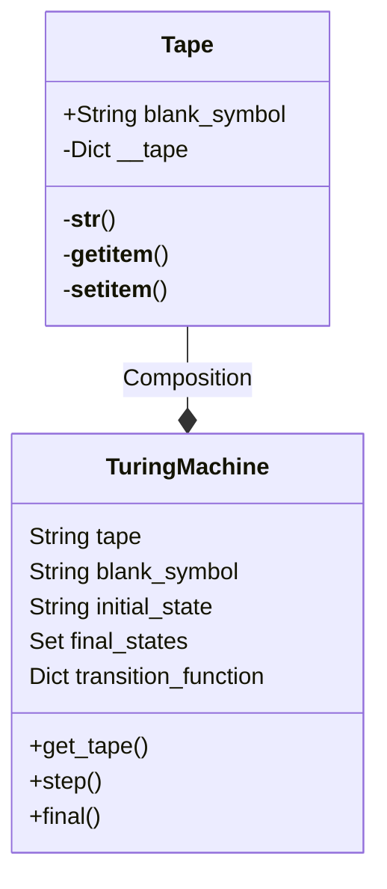

# 原理

Updated 1019 GMT+8 Dec 12, 2023

2023 fall, Complied by Hongfei Yan


AC4正常能优秀，届时需要稍微调整。学校看85分界。

大概思路是：免修级别的10%同学不算，再争取40%+优秀率。


# 1 计算机原理

对计算机设计具有重要意义的三个原理：图灵机、进程的虚拟地址空间和 ASCII 表。

## 1.2 图灵机

​	艾伦·麦席森·图灵（Alan Mathison Turing，又译阿兰·图灵，1912 年 6 月 23 日－1954 年 6 月 7 日）。阿兰·图灵在 1937 年首次提出一个通用计算设备的设想。设想所有的计算都可能在一种特殊的机器上执行，这就图灵机（Turning Machine）。他将模型建立在人们进行计算过程的行为上，并将这些行为抽象到用于计算的机器的模型中。图灵机由两部分构成，如图1-13所示。

- 一条存储带（tape）：双向无限延长，上有一个个方格（field），每个方格可以包含一个有限字母的字符。在一个真正的机器中，磁带必须足够大，以包含算法的所有数据。

- 一个控制器：包含一个可以双向移动的读写头（head），可以在所处方格中读写一个字符；图灵机每时每刻都处于某种状态（current state），是有限数量的状态中的一种；可以接受设定好的图灵程序 （program），该程序是一个转换列表，它决定了一个给定的 State 和 head 下字符的新状态，一个必须写入 head 下方格的字符和  head 的运动方向，即左、右或静止不动。


图1-13 由一条存储带和一个控制器构成的图灵机（注：图片来源为 baike.sogou.com，2023年1月)


​	aturingmachine.com 上面展示了 Mike Davey 建造一台机器，如图1-14所示，体现图灵论文中提出的机器的经典外观和感觉。这台图灵机是由微控制器控制的，但它在运行时的操作只基于从 SD 卡加载的一组状态转换，以及从磁带上写入和读取的内容。虽然看起来磁带只是机器的输入和输出，但事实并非如此！磁带也不仅仅是机器的存储器。在某种程度上，磁带就是计算机。当磁带上的符号被简单的规则所操纵时，计算就发生了。图灵机的核心是读写头，读写头传送磁带，并将磁带上的单元格适当地定位。它可以读取一个单元，确定那里写了什么，如果有的话，是什么符号。这台机器一次只工作在一个单元上，并且知道一个单元的情况。机器中的磁带是一卷1000英尺长的白色35毫米胶片带。字符1和0，是由机器用黑色笔写的。


图1-14  体现图灵机模型的机器（注：图片来源为aturingmachine.com，2022年5月）


​	附录1A 是软件实现图灵机，https://github.com/GMyhf/2019fall-cs101/tree/master/TuringMachine 。参考：https://www.python-course.eu/turing_machine.php ，增加了加法操作，实现下面14分钟视频中的加法。软件实现是用 Python 语言面向对象的编程（Object Orientation Programming，OOP）方式实现的。Python的 OOP 语法，可以参考 https://www.runoob.com/python3/python3-class.html 。

​	图灵机的构成，6分钟视频讲解在 https://www.bilibili.com/video/BV12B4y1X7QV/?spm_id_from=333.788

​	图灵机运作原理及示例，14分钟视频讲解在 https://www.bilibili.com/video/BV13v4y1w7yM/?spm_id_from=333.788


## 1.2 虚拟地址空间

​	计算机的基础架构自从 20 世纪 40 年代起就已经形成规范，包括处理器、存储指令和数据的内存、输入和输出设备。它通常叫作冯·诺依曼架构，以约翰·冯·诺依曼（德語：John Von Neumann，1903 年12 月 28 日－1957 年 2 月 8 日）的名字来命名，他在 1946 年发表的论文里描述了这一架构。论文的开头句，用现在的专门术语来说就是，CPU提 供算法和控制，而 RAM 和磁盘则是记忆存储，键盘、鼠标和显示器与操作人员交互。其中需要重点理解的是与存储相关的进程的虚拟地址空间。

​	在《深入理解计算机系统》[8]第一章中讲到了进程的虚拟地址空间。虚拟存储器是一个抽象概念，它为每个进程提供了一个假象，好像每个进程都在独占地使用主存。每个进程看到的存储器都是一致的，称之为虚拟地址空间。如图1-15所示的是 Linux 进程的虚拟地址空间（其他 Unix 系统的设计与此类似）。在 Linux 中，最上面的四分之一的地址空间是预留给操作系统中的代码和数据的，这对所有进程都一样。底部的四分之三的地址空间用来存放用户进程定义的代码和数据。请注意，图中的地址是从下往上增大的。


图1-15 进程的虚拟地址空间（Process virtual address space）（注：图片来源为 Randal Bryant[8]，2015年3月）


​	每个进程看到的虚拟地址空间由准确定义的区（area）构成，每个区都有专门的功能。简单看下每一个区，从最低的地址开始，逐步向上研究。

- 程序代码和数据（code and data）。代码是从同一固定地址开始，紧接着的是和全局变量相对应的数据区。代码和数据区是由可执行目标文件直接初始化的，示例中就是可执行文件hello。

- 堆（heap）。紧随代码和数据区之后的是运行时堆（Run-time heap）。代码和数据区是在进程一旦开始运行时就被指定了大小的，与此不同，作为调用像 malloc 和 free 这样的 C 标准库函数的结果，堆可以在运行时动态地扩展和收缩。

- 共享库（shared libraries）。在地址空间的中间附近是一块用来存放像标准库和数学库这样共享库的代码和数据的区域。共享库的概念非常强大。

- 栈（stack）。位于用户虚拟地址空间顶部的是用户栈，编译器用它来实现函数调用。和堆一样，用户栈（User stack）在程序执行期间可以动态地扩展和收缩。特别地，每次我们调用一个函数时，栈就会增长。每次我们从函数返回时，栈就会收缩。

- 内核虚拟存储器（kernal virtal memory）。内核是操作系统总是驻留在存储器中的部分。地址空间顶部是为内核预留的。应用程序不允许读写这个区域的内容或者直接调用内核代码定义的函数。

​	虚拟存储器的运作需要硬件和操作系统软件间的精密复杂的互相合作，包括对处理器生成的每个地址的硬件翻译。基本思想是把一个进程虚拟存储器的内容存储在磁盘上，然后用主存作为磁盘的高速缓存。


## 1.2 ASCII 表

​	在《 计算机科学导论》[6]第三章中讲到，计算机外部的不同数据类型（Text, Number, Image, Audio, Video）的数据都采用统一的数据表示法转换后存入计算机中，输出时再还原回来，这种通用的格式称为位模式（bit pattern）。不同数据类型的存储如图1-16所示。


图1-16 不同数据类型的存储（注：图片来源为 Behrouz Forouzan[6]，2008年12月）


​	位（bit）是存储在计算机中的最小数据单位，它是0或1。位代表设备的某一状态，例如：用1表示开关合上，0表示断开。为了表示数据的不同类型，使用位模式，它是一个序列，是0和1组和。通常长度位8的位模式称为1个字节（byte）。

​	接下来我们来看文本（Text）是如何存储的。在任何语言中, 文本都是由一些符号组成。位模式可以表示任何一个符号。需要多少位来表示一个符号取决于该语言使用的符号的数量，如表1-2所示。


表1-2 符号数量和位模式长度

| 符号数目 | 位模式的长度 |
| -------- | ------------ |
| 2        | 1            |
| 4        | 2            |
| 8        | 3            |
| 16       | 4            |
| 256      | 8            |
| 65536    | 16           |

​		

​	不同的位模式集合被设计用于表示文本符号，每个集合被称为代码表, 表示符号的过程称为编码。美国国家标准协会（American National Standards Institute，记为 ANSI）发布了美国信息交换标准码（American Standard Code for Information Interchange，记为 ASCII）的代码表。该代码使用一串 7位二进制数表示每个符号，可以定义 2^7^=128 种不同的符号，包括英语中常用的 26 个大写字母，26 个小写字母，9 个字符，以及标点符号等。如图1-17所示，展示了四个大写字母对应的二进制位模式表示。


图1-17 大写字母的二进制位模式表示


​	编程语言，如果注释也写成英文，使用ASCII中包含的字符就够用了。ASCII 为控制字符保留了前 32个代码，这些代码最初的目的不是为了携带可打印信息，而是为了控制使用 ASCII 的设备（如打印机）。例如，十进制字符 10 代表 "换行 "功能（使打印机推进纸张），字符 27 代表 "转义 "键，经常出现在普通[键盘]的左上角。代码 127（全部七位开启），另一个特殊字符，相当于 "删除 "或 "擦除"。需要掌握的是图1-18中划线标识的代码，10 换行，13 回车，48-57 表示数字 0-9，65-90 表示大写字母，97-122 表示小写字母。如果记不住确切的对应十进制字符，记住大写字母在小写字母之前也可以。


图1-18 ASCII代码表（注：图片来源为 lookuptables.com。增加了两条横线和三个矩形框，用来突出重点部分）


​	如果有 Python 环境，可以在命令行中，输出 ASCII 表内容。

```python
In[1]: import string
In[2]: string.printable

Out[2]: '0123456789abcdefghijklmnopqrstuvwxyzABCDEFGHIJKLMNOPQRSTUVWXYZ!"#$%&\'()*+,-./:;<=>?@[\\]^_`{|}~ \t\n\r\x0b\x0c'
```


​	第 2 行的 string.printable 是调用了 string 类中的 printable 函数。如果想知道 string 中包含哪些函数，可以 dir。

```python
In[3]: dir(string)
Out[3]: 
['Formatter',
 'Template',
 '_ChainMap',
 '_TemplateMetaclass',
 '__all__',
 '__builtins__',
 '__cached__',
 '__doc__',
 '__file__',
 '__loader__',
 '__name__',
 '__package__',
 '__spec__',
 '_re',
 '_sentinel_dict',
 '_string',
 'ascii_letters',
 'ascii_lowercase',
 'ascii_uppercase',
 'capwords',
 'digits',
 'hexdigits',
 'octdigits',
 'printable',
 'punctuation',
 'whitespace']
```


​	ASCII 有结构特点。数字 0-9 以二进制的方式表示，其数值前缀为 0011。小写字母和大写字母在位模式上只有一位的差别，这就把大小写转换简化为一个范围测试（以避免转换不是字母的字符）和一个单一的比特操作。快速的大小写转换很重要，因为它经常被用于大小写搜索算法中。

​	例子: 将任何 ASCII 字母变成小写字母。

​	在 ASCII 中，大写字母和小写字母的区别在于位 00100000（十六进制表示是 20h）的值，该位在小写字母中被打开。如果 "打开 "这个位，大写字母就会变成小写字母。(如果该字母已经是小写字母，20h位已经打开；打开它没有任何区别)。 "打开 " 20h 位，被称为 ORing-in 位，因为使用的是位布尔 OR 操作符（bitwise Boolean OR operator，http://teaching.idallen.com/cst8214/08w/notes/bit_operations.txt）。


```python
'''
				01000001 = 41h = ASCII upper-case letter 'A'

OR			00100000 = 20h <-- this is the bit we want turned on

				--------

EQUALS	01100001 = 61h = ASCII lower-case letter 'a'
'''

uppera = ord('A')
lowera = uppera | 0x20    # bitwise OR with 20h 
print(chr(lowera))

lowera = uppera  |  (1<<5)
print(chr(lowera))


lowera = ord('a')
uppera = lowera  &  ~0x20    # bitwise AND with 10111111
print(chr(uppera))

uppera = lowera  &  ~(1<<5)
print(chr(uppera))

#a
#a
#A
#A
```


## 附录1A 软件实现图灵机

​	如图附录1A-1所示，先给出两个类图（类图相当于是 OOP 编程实现前的蓝图设计），Tape 类 和 TuringMachine 类，然后给出 Python 实现代码，下载网址 https://github.com/GMyhf/2019fall-cs101/tree/master/TuringMachine ，参考了  https://www.python-course.eu/turing_machine.php。	

​	图灵机是一个数学模型，是一个简单的计算机模型，但它具有通用计算机的完整计算能力。

​	图灵机定义为 $M = （Q, \Sigma, \Gamma, \delta, b, q_0, q_f）$

​	\- $Q$ 表示控制器有限状态集 (the set of states)

​	- $\Sigma$ 表示输入的字母表 (the input alphabet)

​	\- $\Gamma$ 表示磁带上的字母表 (the tape alphabet)，$\Sigma \subseteq \Gamma$

​	\- $\delta: Q \times \Gamma \rightarrow Q \times \Gamma \times \{L, R, N\}$ 是状态转移函数 (the transition function)，即图程序。L、R、N分别表示左移一格，右移一格或停机

​	\- $b$ 是空白字符 (the blank symbol)，$b \in \Gamma \backslash \Sigma$ 

​	\- $q_0$ 是开始状态，$q_0 \in Q$

​	\- $q_f$ 是接收或终止状态，$q_f \in Q$




图附录1A-1 图灵机类图


​	三个源码：turing_machine.py, binary_complement, TM_adding.py。前两个取自 https://www.python-course.eu/turing_machine.php，实现了二进制补0到1，1到0的代码。我们增加了第三个做加法的代码。

```python
# ref: https://www.python-course.eu/turing_machine.php
# turing_machine.py
class Tape:
    
    blank_symbol = " "
    
    def __init__(self,
                 tape_string = ""):
        self.__tape = dict((enumerate(tape_string)))
        # last line is equivalent to the following three lines:
        #self.__tape = {}
        #for i in range(len(tape_string)):
        #    self.__tape[i] = input[i]
        
    def __str__(self):
        s = ""
        min_used_index = min(self.__tape.keys()) 
        max_used_index = max(self.__tape.keys())
        for i in range(min_used_index, max_used_index):
            s += self.__tape[i]
        return s    
   
    def __getitem__(self,index):
        if index in self.__tape:
            return self.__tape[index]
        else:
            return Tape.blank_symbol

    def __setitem__(self, pos, char):
        self.__tape[pos] = char 

        
class TuringMachine:
    
    def __init__(self, 
                 tape = "", 
                 blank_symbol = " ",
                 initial_state = "",
                 final_states = None,
                 transition_function = None):
        self.__tape = Tape(tape)
        self.__head_position = 0
        self.__blank_symbol = blank_symbol
        self.__current_state = initial_state
        if transition_function == None:
            self.__transition_function = {}
        else:
            self.__transition_function = transition_function
        if final_states == None:
            self.__final_states = set()
        else:
            self.__final_states = set(final_states)
        
    def get_tape(self): 
        return str(self.__tape)
    
    def step(self):
        char_under_head = self.__tape[self.__head_position]
        x = (self.__current_state, char_under_head)
        if x in self.__transition_function:
            y = self.__transition_function[x]
            self.__tape[self.__head_position] = y[1]
            if y[2] == "R":
                self.__head_position += 1
            elif y[2] == "L":
                self.__head_position -= 1
            self.__current_state = y[0]

    def final(self):
        if self.__current_state in self.__final_states:
            return True
        else:
            return False
```


​	如果对上面类图的写法不熟悉，可以直接看下面两个 二进制补、加法的 程序，把TuringMachine理解为提供的图灵机工具。

```python
# binary_complement.py
from turing_machine import TuringMachine

initial_state = "init",
accepting_states = ["final"],
transition_function = {("init","0"):("init", "1", "R"),
                       ("init","1"):("init", "0", "R"),
                       ("init"," "):("final"," ", "N"),
                       }
final_states = {"final"}

t = TuringMachine(tape = "010011001",
                  initial_state = "init",
                  final_states = final_states,
                  transition_function = transition_function)

print("Input on Tape:\n" + t.get_tape())

while not t.final():
    t.step()

print("Result of the Turing machine calculation:")
print(t.get_tape())
```

​	运行输出

```
Input on Tape:
01001100
Result of the Turing machine calculation:
101100110
```


​	我们实现了“图灵机运作原理及示例” 视频中讲到的加法， https://www.bilibili.com/video/BV13v4y1w7yM/?spm_id_from=333.788。注意该视频讲解，缺少终止状态，会死循环，所以程序中加了终止状态final_states。


```python
# TM_adding.py
#ref: https://www.python-course.eu/turing_machine.php

from turing_machine import TuringMachine

initial_state = "q1",
accepting_states = ["q3"],
transition_function = {("q1","1"):("q1", "1", "R"),
                       ("q1"," "):("q2", "1", "R"),
                       ("q2","1"):("q2", "1", "R"),
                       ("q2"," "):("q3", "b", "L"),
                       ("q3","1"):("q3", "b", "H"),
                       ("q3"," "):("q3", "b", "H")
                       }
final_states = {"q3"}

t = TuringMachine(tape = "1111 111 ", 
                  initial_state = "q1",
                  final_states = final_states,
                  transition_function = transition_function)

print("Input on Tape:\n" + t.get_tape())

while not t.final():
    t.step()
    #print(t.get_tape())

print("Result of the Turing machine calculation:")    
print(t.get_tape())
```

​	运行输出

```
Input on Tape:
1111 1111
Result of the Turing machine calculation:
1111111
```


# 2 将递归视为一种扩展的循环控制结构，通过遍历来找到问题的答案

递归的特点和优缺点也是很重要的。递归的特点包括问题分解、自我调用和终止条件。然而，递归也可能引发一些问题，例如递归深度过大可能导致栈溢出，递归算法的效率可能不如迭代等。因此，在使用递归时需要注意选择合适的问题和适当的终止条件，以避免潜在的问题。

​	此时可以回顾计算机原理——虚拟地址空间，其中的栈（stack）段与递归紧密相关。每个进程看到的虚拟地址空间由准确定义的区（area）构成，每个区都有专门的功能。栈位于用户虚拟地址空间顶部的是用户栈，编译器用它来实现函数调用。和堆一样，用户栈（User stack）在程序执行期间可以动态地扩展和收缩。特别地，每次我们调用一个函数时，栈就会增长。每次我们从函数返回时，栈就会收缩。


## 02287: Tian Ji -- The Horse Racing

greedy, http://cs101.openjudge.cn/practice/02287


解决问题的基本情况和递归关系，列出逻辑处理过程的要点：

田忌赛马题目中基本情况是比赛轮数大于等于n。递归关系是在每次递归调用中，计算两种情况下的得分：一种是田忌使用当前最普通马与国王的最普通马比较，另一种是田忌使用最普通马与国王的最超级马比较。然后，选择得分最高的情况作为当前轮次的最优解。

程序解读：

限定了递归深度。实现了比较函数和深度优先搜索函数，并且通过lru_cache来存储记忆化结果。

程序的主要逻辑在一个while循环中，当输入的n等于0时，循环结束。在每个测试用例中，程序首先读取田忌和国王马的速度值，并对它们进行排序。

接下来，程序定义了一个使用递归的深度优先搜索(dfs)函数。dfs函数的参数包括当前轮次的国王马起始位置(start)、结束位置(end)、当前田忌马的索引(i)和比赛轮数n。

dfs

```python
# 赵时阳-数院23

from functools import lru_cache
import sys
sys.setrecursionlimit(1 << 30)


def compare(a, b):
    if a > b:
        return 1
    elif a == b:
        return 0
    else:
        return -1

while True:
    n = int(input())
    if n == 0: 
        break

    tian_values = list(map(int, input().split()))
    king_values = list(map(int, input().split()))
    tian_values.sort()
    king_values.sort()

    @lru_cache(maxsize=2048)
    def dfs(start, end, i):
        if i < n:
            tian_value = tian_values[i]
            king_value_start = king_values[start]
            x1 = dfs(start + 1, end, i + 1) + compare(tian_value, king_value_start)
            
            king_value_end = king_values[end]
            x2 = dfs(start, end - 1, i + 1) + compare(tian_value, king_value_end)  
            x = max(x1, x2)
            return x
        else:
            return 0

    result = dfs(0, n - 1, 0)
    print(200 * result)

```


# 3 二进制


## 02706: 麦森数

http://cs101.openjudge.cn/routine/02706/

形如2\^p-1的素数称为麦森数，这时P一定也是个素数。但反过来不一定，即如果P是个素数。2^p-1不一定也是素数。到1998年底，人们已找到了37个麦森数。最大的一个是P=3021377，它有909526位。麦森数有许多重要应用，它与完全数密切相关。
任务：从文件中输入P (1000<P<3100000) ,计算 2^p-1 的位数和最后500位数字（用十进制高精度数表示）

**输入**

文件中只包含一个整数P (1000<P<3100000)

**输出**

第1行：十进制高精度数 2^p-1 的位数。
第2-11行：十进制高精度数 2^p-1的最后500位数字。（每行输出50位，共输出10行，不足500位时高位补0）
不必验证 2^p-1与P是否为素数。

样例输入

```
1279
```

样例输出

```
386
00000000000000000000000000000000000000000000000000
00000000000000000000000000000000000000000000000000
00000000000000104079321946643990819252403273640855
38615262247266704805319112350403608059673360298012
23944173232418484242161395428100779138356624832346
49081399066056773207629241295093892203457731833496
61583550472959420547689811211693677147548478866962
50138443826029173234888531116082853841658502825560
46662248318909188018470682222031405210266984354887
32958028878050869736186900714720710555703168729087
```

来源

联赛复赛试题2003


```python
# 23数院 胡睿诚
from math import log10, ceil
M = 10**500
MAXP = 3100000

p = int(input())
print(int(p*log10(2)) + 1)
#print(ceil(p*0.3010299956639812))

a = [2]
for _ in range(len(bin(MAXP)) - 2):
    a.append((a[-1]**2) % M)

s = 1
i = 0
for j in reversed(bin(p)[2:]):
    if j == '1':
        s = (s*a[i]) % M
    i += 1

ans = list(str(s-1))
l = len(ans)
if l < 500:
    ans = ['0']*(500-l)+ans
for i in range(0, 500, 50):
    print(''.join(ans[i:i+50]))
```


# 4 堆

## 18164: 剪绳子

greedy/huffman, http://cs101.openjudge.cn/practice/18164/


## 04087: 数据筛选

data structure, http://cs101.openjudge.cn/practice/04087/

总时间限制: 10000ms 单个测试点时间限制:  5000ms 内存限制: **3000kB**

描述

小张需要从一批数量庞大的正整数中挑选出第k小的数，因为数据量太庞大，挑选起来很费劲，希望你能编程帮他进行挑选。

**输入**

第一行第一个是数据的个数n(10<=n<=106)，第二个是需要挑选出的数据的序号k(1<=k<=105)，n和k以空格分隔； 第二行以后是n个数据T(1<=T<=109)，数据之间以空格或者换行符分隔。

**输出**

第k小数（如果有相同大小的也进行排序，例如对1,2,3,8,8，第4小的为8，第5小的也为8）。

样例输入

`10 5 1  3  8 20 2  9 10 12  8 9 `

样例输出

`8`


```python
import array										# Memory Limit Exceed
import heapq

n, k = map(int, input().split())

q = []
cnt = 0

while True:
    x = array.array('i', map(int, input().split()))
    cnt += len(x)
    for i in x:
        heapq.heappush(q, -i)
        if len(q) > k:
            heapq.heappop(q)
    if cnt >= n:
        break

print(-q[0])
```


该程序的功能是从输入的一组整数中找到第 k 大的数。它使用优先队列来维护当前遍历到的最大的 k 个数，每次将新的数插入到队列中，如果队列的大小超过了 k，则将最大的数移除。最后输出优先队列的顶部元素，即第 k 大的数。

```c++
#include <iostream>								// time: 340ms
#include <queue>
using namespace std;

int main() {

	int n,k,num;
	cin>>n>>k;

	priority_queue<int> q;

	for (int i=0; i<n; ++i) {
		cin>>num;
		q.push(num);
		if (q.size() > k)
			q.pop();
	}

	cout<<q.top()<<endl;

	return 0;
}
```


## 02754: 八皇后

dfs and similar, http://cs101.openjudge.cn/practice/02754

描述：会下国际象棋的人都很清楚：皇后可以在横、竖、斜线上不限步数地吃掉其他棋子。如何将8个皇后放在棋盘上（有8 * 8个方格），使它们谁也不能被吃掉！这就是著名的八皇后问题。
		对于某个满足要求的8皇后的摆放方法，定义一个皇后串a与之对应，即$a=b_1b_2...b_8~$,其中$b_i$为相应摆法中第i行皇后所处的列数。已经知道8皇后问题一共有92组解（即92个不同的皇后串）。
		给出一个数b，要求输出第b个串。串的比较是这样的：皇后串x置于皇后串y之前，当且仅当将x视为整数时比y小。

​	八皇后是一个古老的经典问题：**如何在一张国际象棋的棋盘上，摆放8个皇后，使其任意两个皇后互相不受攻击。**该问题由一位德国**国际象棋排局家** **Max Bezzel** 于 1848年提出。严格来说，那个年代，还没有“德国”这个国家，彼时称作“普鲁士”。1850年，**Franz Nauck** 给出了第一个解，并将其扩展成了“ **n皇后** ”问题，即**在一张 n** x **n 的棋盘上，如何摆放 n 个皇后，使其两两互不攻击**。历史上，八皇后问题曾惊动过“数学王子”高斯(Gauss)，而且正是 Franz Nauck 写信找高斯请教的。

**输入**

第1行是测试数据的组数n，后面跟着n行输入。每组测试数据占1行，包括一个正整数b(1 ≤  b ≤  92)

**输出**

输出有n行，每行输出对应一个输入。输出应是一个正整数，是对应于b的皇后串。

样例输入

```
2
1
92
```

样例输出

```
15863724
84136275
```


八皇后思路：回溯法。从第一行第一列开始放置皇后，然后在每一行的不同列都放置，如果与前面不冲突就继续，有冲突则回到上一行继续下一个可能性。


这里在记录解的时候，不能直接引用数组，否则最终解集中的解都是重复的，要进行拷贝，另外开辟出一个数组空间用解集记录。

```python
ans = []
def queen_dfs(A, cur=0):          #考虑放第cur行的皇后
    if cur == len(A):             #如果已经放了n个皇后，一组新的解产生了
        ans.append(''.join([str(x+1) for x in A])) #注意避免浅拷贝
        return 
    
    for col in range(len(A)):     #将当前皇后逐一放置在不同的列，每列对应一组解
        for row in range(cur):    #逐一判定，与前面的皇后是否冲突
            #因为预先确定所有皇后一定不在同一行，所以只需要检查是否同列，或者在同一斜线上
            if A[row] == col or abs(col - A[row]) == cur - row:
                break
        else:                     #若都不冲突
            A[cur] = col          #放置新皇后，在cur行，col列
            queen_dfs(A, cur+1)	  #对下一个皇后位置进行递归
            
queen_dfs([None]*8)   
for _ in range(int(input())):
    print(ans[int(input()) - 1])
```


```python
"""
当使用回溯法解决 N 皇后问题时，在每一行中依次尝试放置皇后，
然后回溯处理不符合条件的情况。
"""
result = []

def is_valid(former, row, col):
    for i in range(row):
        if former[i] == col or abs(i - row) == abs(former[i] - col):
            return False
    return True

def backtrack(former=[], row=0):
    if row == 8:
        result.append(former[:])
        return
    for col in range(8):
        if is_valid(former, row, col):
            former.append(col)
            backtrack(former, row + 1)
            former.pop()

backtrack()
n = int(input())
for i in range(n):
    index = int(input())
    print("".join(str(x+1) for x in result[index - 1]))
```


# 5 二分法


数院胡睿诚：这就是个求最小值的最大值或者最大值的最小值的一个套路。

求最值转化为判定对不对，判定问题是可以用贪心解决的，然后用二分只用判定log次。


## 08210: 河中跳房子/石头

binary search/greedy, http://cs101.openjudge.cn/practice/08210

每年奶牛们都要举办各种特殊版本的跳房子比赛，包括在河里从一个岩石跳到另一个岩石。这项激动人心的活动在一条长长的笔直河道中进行，在起点和离起点L远 (1 ≤ *L*≤ 1,000,000,000) 的终点处均有一个岩石。在起点和终点之间，有*N* (0 ≤ *N* ≤ 50,000) 个岩石，每个岩石与起点的距离分别为$Di (0 < Di < L)$。

在比赛过程中，奶牛轮流从起点出发，尝试到达终点，每一步只能从一个岩石跳到另一个岩石。当然，实力不济的奶牛是没有办法完成目标的。

农夫约翰为他的奶牛们感到自豪并且年年都观看了这项比赛。但随着时间的推移，看着其他农夫的胆小奶牛们在相距很近的岩石之间缓慢前行，他感到非常厌烦。他计划移走一些岩石，使得从起点到终点的过程中，最短的跳跃距离最长。他可以移走除起点和终点外的至多*M* (0 ≤ *M* ≤ *N*) 个岩石。

请帮助约翰确定移走这些岩石后，最长可能的最短跳跃距离是多少？


**输入**

第一行包含三个整数L, N, M，相邻两个整数之间用单个空格隔开。
接下来N行，每行一个整数，表示每个岩石与起点的距离。岩石按与起点距离从近到远给出，且不会有两个岩石出现在同一个位置。

**输出**

一个整数，最长可能的最短跳跃距离。

样例输入

```
25 5 2
2
11
14
17
21
```

样例输出

```
4
```

提示：在移除位于2和14的两个岩石之后，最短跳跃距离为4（从17到21或从21到25）。


二分法思路参考：https://blog.csdn.net/gyxx1998/article/details/103831426

**用两分法去推求最长可能的最短跳跃距离**。
最初，待求结果的可能范围是[0，L]的全程区间，因此暂定取其半程(L/2)，作为当前的最短跳跃距离，以这个标准进行岩石的筛选。
**筛选过程**是：
先以起点为基点，如果从基点到第1块岩石的距离小于这个最短跳跃距离，则移除第1块岩石，再看接下来那块岩石（原序号是第2块），如果还够不上最小跳跃距离，就继续移除。。。直至找到一块距离基点超过最小跳跃距离的岩石，保留这块岩石，并将它作为新的基点，再重复前面过程，逐一考察和移除在它之后的那些距离不足的岩石，直至找到下一个基点予以保留。。。
当这个筛选过程最终结束时，那些幸存下来的基点，彼此之间的距离肯定是大于当前设定的最短跳跃距离的。
这个时候要看一下被移除岩石的总数：

- 如果总数>M，则说明被移除的岩石数量太多了（已超过上限值），进而说明当前设定的最小跳跃距离(即L/2)是过大的，其真实值应该是在[0, L/2]之间，故暂定这个区间的中值(L/4)作为接下来的最短跳跃距离，并以其为标准重新开始一次岩石筛选过程。。。
- 如果总数≤M，则说明被移除的岩石数量并未超过上限值，进而说明当前设定的最小跳跃距离(即L/2)很可能过小，准确值应该是在[L/2, L]之间，故暂定这个区间的中值(3/4L)作为接下来的最短跳跃距离

```python
L,n,m = map(int,input().split())
rock = [0]
for i in range(n):
    rock.append(int(input()))
rock.append(L)

def check(x):
    num = 0
    now = 0
    for i in range(1, n+2):
        if rock[i] - now < x:
            num += 1
        else:
            now = rock[i]
            
    if num > m:
        return True
    else:
        return False

# https://github.com/python/cpython/blob/main/Lib/bisect.py
'''
2022fall-cs101，刘子鹏，元培。
源码的二分查找逻辑是给定一个可行的下界和不可行的上界，通过二分查找，将范围缩小同时保持下界可行而区间内上界不符合，
但这种最后print(lo-1)的写法的基础是最后夹出来一个不可行的上界，但其实L在这种情况下有可能是可行的
（考虑所有可以移除所有岩石的情况），所以我觉得应该将上界修改为不可能的 L+1 的逻辑才是正确。
例如：
25 5 5
1
2
3
4
5

应该输出 25
'''
# lo, hi = 0, L
lo, hi = 0, L+1
ans = -1
while lo < hi:
    mid = (lo + hi) // 2
    
    if check(mid):
        hi = mid
    else:               # 返回False，有可能是num==m
        ans = mid       # 如果num==m, mid就是答案
        lo = mid + 1
        
#print(lo-1)
print(ans)
```


## 04135: 月度开销

binary search/greedy , http://cs101.openjudge.cn/practice/04135

农夫约翰是一个精明的会计师。他意识到自己可能没有足够的钱来维持农场的运转了。他计算出并记录下了接下来 *N* (1 ≤ *N* ≤ 100,000) 天里每天需要的开销。

约翰打算为连续的*M* (1 ≤ *M* ≤ *N*) 个财政周期创建预算案，他把一个财政周期命名为fajo月。每个fajo月包含一天或连续的多天，每天被恰好包含在一个fajo月里。

约翰的目标是合理安排每个fajo月包含的天数，使得开销最多的fajo月的开销尽可能少。

**输入**

第一行包含两个整数N,M，用单个空格隔开。
接下来N行，每行包含一个1到10000之间的整数，按顺序给出接下来N天里每天的开销。

**输出**

一个整数，即最大月度开销的最小值。

样例输入

```
7 5
100
400
300
100
500
101
400
```

样例输出

```
500
```

提示：若约翰将前两天作为一个月，第三、四两天作为一个月，最后三天每天作为一个月，则最大月度开销为500。其他任何分配方案都会比这个值更大。


在所给的N天开销中寻找连续M天的最小和，即为最大月度开销的最小值。

与 `OJ08210：河中跳房子`  一样都是二分+贪心判断，但注意这道题目是最大值求最小。

参考 bisect 源码的二分查找写法，https://github.com/python/cpython/blob/main/Lib/bisect.py ，两个题目的代码均进行了规整。
因为其中涉及到 num==m 的情况，有点复杂。二者思路一样，细节有点不一样。

```python
n,m = map(int, input().split())
expenditure = []
for _ in range(n):
    expenditure.append(int(input()))

def check(x):
    num, s = 1, 0
    for i in range(n):
        if s + expenditure[i] > x:
            s = expenditure[i]
            num += 1
        else:
            s += expenditure[i]
    
    return [False, True][num > m]

# https://github.com/python/cpython/blob/main/Lib/bisect.py
lo = max(expenditure)
# hi = sum(expenditure)
hi = sum(expenditure) + 1
ans = 1
while lo < hi:
    mid = (lo + hi) // 2
    if check(mid):      # 返回True，是因为num>m，是确定不合适
        lo = mid + 1    # 所以lo可以置为 mid + 1。
    else:
        ans = mid    # 如果num==m, mid就是答案
        hi = mid
        
#print(lo)
print(ans)
```


为了练习递归，写出了下面代码

```python
n, m = map(int, input().split())
expenditure = [int(input()) for _ in range(n)]

left,right = max(expenditure), sum(expenditure)

def check(x):
    num, s = 1, 0
    for i in range(n):
        if s + expenditure[i] > x:
            s = expenditure[i]
            num += 1
        else:
            s += expenditure[i]
    
    return [False, True][num > m]

res = 0

def binary_search(lo, hi):
    if lo >= hi:
        global res
        res = lo
        return
    
    mid = (lo + hi) // 2
    #print(mid)
    if check(mid):
        lo = mid + 1
        binary_search(lo, hi)
    else:
        hi = mid
        binary_search(lo, hi)
        
binary_search(left, right)
print(res)
```


2021fall-cs101，郑天宇。

一开始难以想到用二分法来解决此题，主要是因为长时间被从正面直接解决问题的思维所禁锢，忘记了**==对于有限的问题，其实可以采用尝试的方法来解决==**。这可能就是“计算思维”的生动体现吧，也可以说是计算概论课教会我们的一个全新的思考问题的方式。

2021fall-cs101，韩萱。居然还能这么做...自己真的想不出来，还是“先完成，再完美”，直接看题解比较好，不然自己想是真的做不完的。

2021fall-cs101，欧阳韵妍。

解题思路：这道题前前后后花了大概3h+（如果考试碰到这种题希望我能及时止损马上放弃），看到老师分享的叶晨熙同学的作业中提到“两球之间的最小磁力”问题的题解有助于理解二分搜索，去找了这道题的题解，看完之后果然有了一点思路，体会到了二分搜索其实就相当于一个往空隙里“插板”的问题，只不过可以运用折半的方法代替一步步挪动每个板子，从而降低时间复杂度。不过虽然有了大致思路但是还是不知道怎么具体实现，于是去仔仔细细地啃了几遍题解。def 的check 函数就是得出在确定了两板之间最多能放多少开销后的一种插板方法；两板之间能放的开销的最大值的最大值（maxmax）一开始为开销总和，两板之间能放的开销的最大值的最小值minmax）一开始为开销中的最大值，我们的目标就是尽可能缩小这个maxmax。如果通过每次减去1 来缩小maxmax 就会超时，那么这时候就使用二分方法，看看  (maxmax+minmax)//2 能不能行，如果可以，大于  (maxmax+minmax)//2的步骤就能全部省略了，maxmax 直接变为  (maxmax+minmax)//2；如果不可以，那么让minmax 变成  (maxmax+minmax)//2+1，同样可以砍掉一半【为什么可以砍掉一半可以这样想：按照check（）的定义，如果输出了False 代表板子太多了，那么“两板之间能放的开销的最大值”（这里即middle）太小了，所以最后不可能采用小于middle 的开销，即maxmax不可能为小于middle 的值，那么这时候就可以把小于middle 的值都砍掉】

感觉二分法是用于在一个大范围里面通过范围的缩小来定位的一种缩短搜素次数的方法。

2021fall-cs101，王紫琪。【月度开销】强烈建议把 欧阳韵妍 同学的思路放进题解！对于看懂代码有很大帮助（拯救了我的头发）

```python
n, m = map(int, input().split())
L = list(int(input()) for x in range(n))

def check(x):
    num, cut = 1, 0
    for i in range(n):
        if cut + L[i] > x:
            num += 1
            cut = L[i]  #在L[i]左边插一个板，L[i]属于新的fajo月
        else:
            cut += L[i]
    
    if num > m:
        return False
    else:
        return True

maxmax = sum(L)
minmax = max(L)
while minmax < maxmax:
    middle = (maxmax + minmax) // 2
    if check(middle):   #表明这种插法可行，那么看看更小的插法可不可以
        maxmax = middle
    else:
        minmax = middle + 1#这种插法不可行，改变minmax看看下一种插法可不可以

print(maxmax)
```

