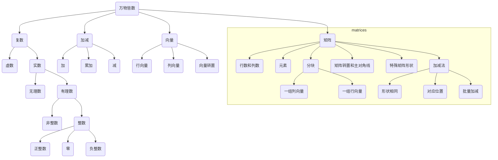

# 计算概论(B) 课前问题4

Updated 1524 GMT+8 Sep 2, 2023


2023 fall, Complied by Hongfei Yan

Markdown（用 https://typoraio.cn 编辑）格式文件在，https://github.com/GMyhf/2023fall-cs101


| 课程号: 04831410		课程名: 计算概论(B)                  | 班号: 12                                              |
| ------------------------------------------------------------ | ----------------------------------------------------- |
| 上课时间: 1-16周 每周 周二 7-9节                             | 地点: 理教208                                         |
| 上机时间: 1-15周 每周 周四 7-8节<br/>期末机考时间: 第16周 周四 7-8节 | 地点：理科1号楼计算中心，二层楼的6号和三层楼的7号机房 |
| 助教：张哲瑞、张以宁、彭亦男、涂程颖、陈威宇                 | 在课程微信群中的名字是“TA-”开始，地点：理科1号楼1220  |


在学习编程的过程中，经常遇到输入的数据是矩阵的形式，所以我们首先来明确矩阵的概念。然后请同学完成 CF263A 题目。


## 1. 知识点：矩阵

这段矩阵知识点的讲解，借鉴自《数学要素》的1.4和1.5节，作者：姜伟生，2023-06-01出版。


万物皆数。
All is Number.
															——毕达哥拉斯(Pythagoras)｜古希腊哲学家、数学家｜570 B.C.—495 B.C.        



​				图1 数的结构


### 1.4　向量：数字排成行、列

向量、矩阵等线性代数概念对于数据科学和机器学习至关重要。在机器学习中，数据几乎都以矩阵形式存储、运算。毫不夸张地说，没有线性代数就没有现代计算机运算。逐渐地，大家会发现算数、代数、解析几何、微积分、概率统计、优化方法并不是一个个孤岛，而线性代数正是连接它们的重要桥梁之一。


#### 行向量、列向量

若干数字排成一行或一列，并且用中括号括起来，得到的数组叫作向量(vector)。
排成一行的叫作行向量(row vector)，排成一列的叫作列向量(column vector)。
通俗地讲，行向量就是表格的一行数字，列向量就是表格的一列数字。以下两例分别展示了行向量和列向量，即
$$
\left[
\matrix{
  1 & 2 & 3 
}
\right]_{1\times 3},

\left[
\matrix{
  1 \\
  2 \\
  3 
}
\right]_{3\times 1}\tag{1}
$$

式(1)中，下角标“1×3”代表“1行、3列”，“3×1”代表“3行、1列”。

#### 转置

转置符号为上标“T”。行向量转置(transpose)可得到列向量；同理，列向量转置可得到行向量。举例如下，有
$$
\left[
\matrix{
  1 & 2 & 3 
}
\right]^\mathrm T
=
\left[
\matrix{
  1 \\
  2 \\
  3 
}
\right],


\left[
\matrix{
  1 \\
  2 \\
  3 
}
\right]^\mathrm T
=
\left[
\matrix{
  1 & 2 & 3 
}
\right]

\tag{2}
$$

### 1.5　矩阵：数字排列成长方形

矩阵(matrix)将一系列数字以长方形方式排列，如


$$
\left[
\matrix{
  1 & 2 & 3 \\
  4 & 5 & 6
}
\right]_{2\times 3},

\left[
\matrix{
  1 & 2 \\
  3 & 4 \\
  5 & 6 
}
\right]_{3\times 2},

\left[
\matrix{
  1 & 2 \\
  3 & 4 
}
\right]_{2\times 2}

\tag{3}
$$


通俗地讲，矩阵将数字排列成表格，有行、有列。式(3)给出了三个矩阵，形状分别是2行3列（记作2×3）、3行2列（记作3×2）和2行2列（记作2×2）。
通常用大写字母代表矩阵，比如矩阵A和矩阵B。
图2所示为一个n×D矩阵X。n是矩阵的行数(number of rows in the matrix)，D是矩阵的列数(number of columns in the matrix)。X可以展开写成表格形式，即
$$
X_{n\times D}=
\left[
\matrix{
  x_{1,1} & x_{1,2} & ... & x_{1,D} \\
  x_{2,1} & x_{2,2} & ... & x_{2,D} \\
  \vdots & \vdots & \ddots & \vdots\\
  x_{n,1} & x_{n,2} & ... & x_{n,D} 
}
\right]

\tag{4}
$$


​				


​				图2　n×D矩阵X


再次强调：先说行序号，再说列序号。数据矩阵一般采用大写X表达。

矩阵X中，元素(element) $x_{i,j}$ 被称作i,j元素（i j entry或i j element），也可以说$x_{i,j}$出现在i行j列(appears in row i and column j)。比如，$x_{n,1}$是矩阵X的第n行、第1列元素。
表1.4总结了如何用英文读矩阵和矩阵元素。

表1.4　矩阵有关英文表达


## 2. 题目：263A. Beautiful Matrix

implementation, 800, http://codeforces.com/problemset/problem/263/A

You've got a 5 × 5 matrix, consisting of 24 zeroes and a single number one. Let's index the matrix rows by numbers from 1 to 5 from top to bottom, let's index the matrix columns by numbers from 1 to 5 from left to right. In one move, you are allowed to apply one of the two following transformations to the matrix:

1. Swap two neighboring matrix rows, that is, rows with indexes *i* and *i* + 1 for some integer *i* (1 ≤ *i* < 5).
2. Swap two neighboring matrix columns, that is, columns with indexes *j* and *j* + 1 for some integer *j* (1 ≤ *j* < 5).

You think that a matrix looks *beautiful*, if the single number one of the matrix is located in its middle (in the cell that is on the intersection of the third row and the third column). Count the minimum number of moves needed to make the matrix beautiful.

**Input**

The input consists of five lines, each line contains five integers: the *j*-th integer in the *i*-th line of the input represents the element of the matrix that is located on the intersection of the *i*-th row and the *j*-th column. It is guaranteed that the matrix consists of 24 zeroes and a single number one.

**Output**

Print a single integer — the minimum number of moves needed to make the matrix beautiful.

Examples

input

```
0 0 0 0 0
0 0 0 0 1
0 0 0 0 0
0 0 0 0 0
0 0 0 0 0
```

output

```
3
```

input

```
0 0 0 0 0
0 0 0 0 0
0 1 0 0 0
0 0 0 0 0
0 0 0 0 0
```

output

```
1
```


请给出Python, C++（选做）, 或者C（选做）实现的代码，填写到下面作业模版中。


## 3. Answer:

【张概论，中国语言文学系，2023年秋】 ==（请改为同学的姓名、院系、操作系统、编程环境等）==

操作系统：macOS Ventura 13.4.1 (c)

Python编程环境：Spyder IDE 5.2.2, PyCharm 2023.1.4 (Professional Edition)

C/C++编程环境：Mac terminal vi (version 9.0.1424), g++/gcc (Apple clang version 14.0.3, clang-1403.0.22.14.1)


思路：==（请改为同学的思路和代码）==

将⼀个数分成两个偶数。

参考了 https://www.moumouwangzhan.cn


### Python3 代码

```python
w = int(input())
if 3<=w<=100 and (w-2) % 2 == 0:
print('YES')
else:
print('NO')
```


Python代码运行截图 ==（请改为同学的截图）==


### C++ 代码

```c++

```


C++ 代码运行截图


### C 代码

```c

```


C 代码运行截图


## 4. 学习总结和收获

待书写
